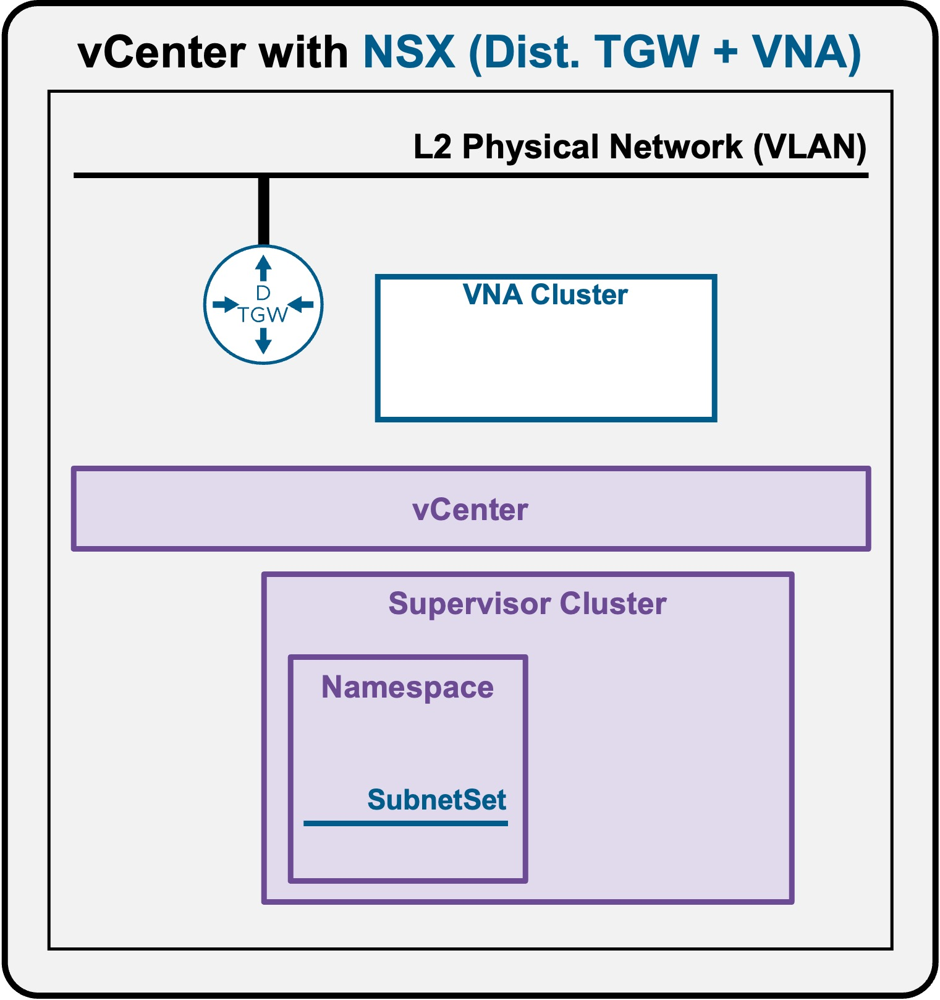
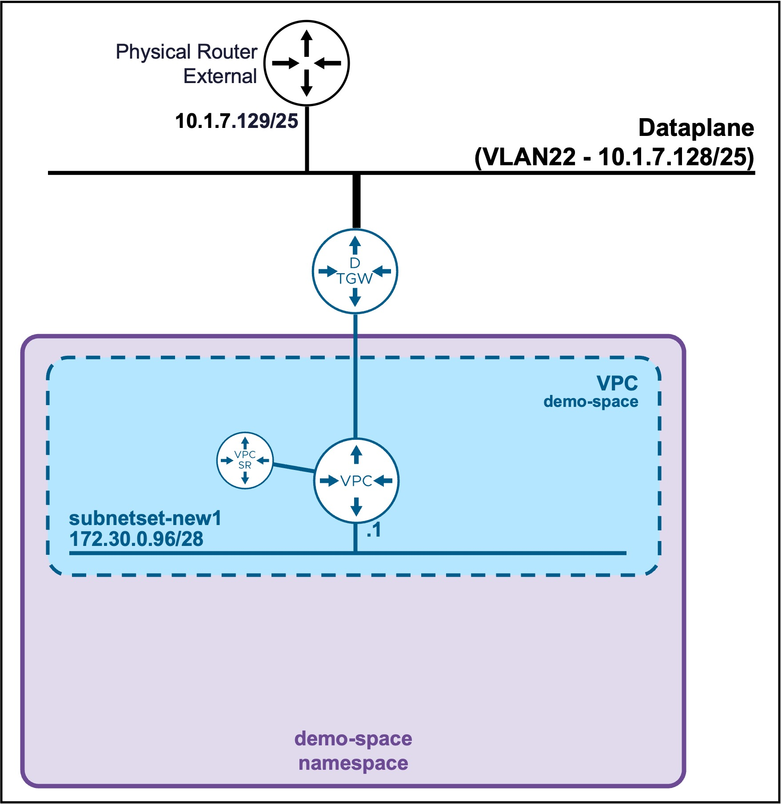
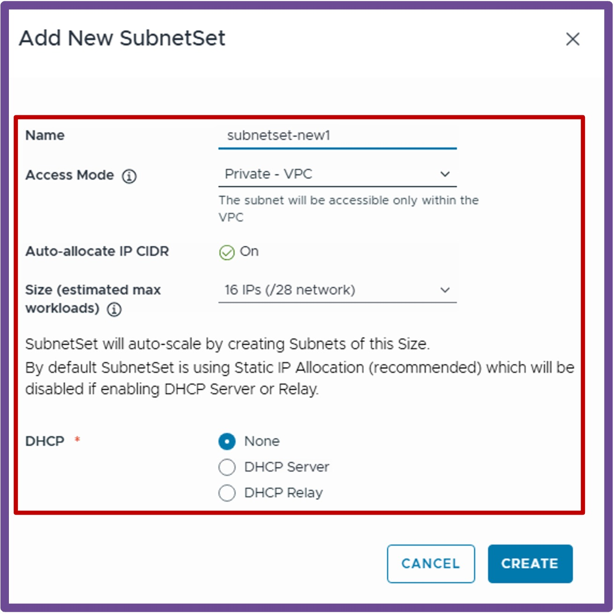
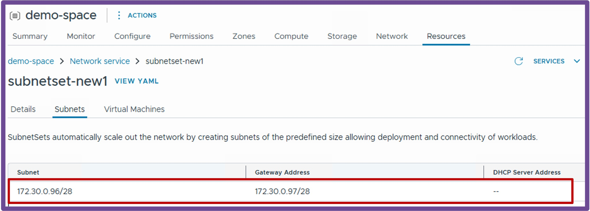

<h1>
   Supervisor with "NSX + DTGW/VNA"
</h1>

This section describes the procedures for **provisioning and managing Network Services within a VKS Namespace utilizing an "NSX + DTGW/VNA" architecture** inside a vSphere environment.

* **Network Services**
    * [Subnets](2h1-network-subnet.md)
    * [**SubnetSets**](#networkservices)
    * [Static Routes](2h3-network-staticroute.md)
    * [External IPs](2h4-network-externalip.md)
    * [VM Load Balancers](2h5-network-lb.md)

{ width="100%" }

---

## Network Services - Subnetsets {: #networkservices }

A **SubnetSet** provides dynamic, automated scaling functionality for subnets:  
<ul style="margin-left: 1rem; padding-left: 1rem;">
  <li style="margin-bottom: 0.5rem;"><b>Scale Out:</b> As soon as a subnet within the SubnetSet consumes its available IP capacity, a new subnet is automatically provisioned.</li>
  <li><b>Scale In:</b> Conversely, when a subnet becomes completely empty (no workload attached to it), it is automatically deleted.</li>
</ul>

For more information about Subnets settings review the [VPC Subnet Overlay page](../vcenter/1b-vpc_subnet.md#overlay){target="_blank"}.

{ width="55%" style="display: block; margin: 0 auto;" }

### Create SubnetSet

Navigate to **vCenter** > **Supervisor Management** > **Supervisors**, select your target Supervisor, click the **Namespaces** tab, and select your specific Namespace.  
Under the **Resources** card, click **Network - Go to Service**.  
{ width="95%" style="display: block; margin: 0 auto;" }

1. **Create New SubnetSet**  
Navigate to **SubnetSets**, and click **New SubnetSet**.  
{ width="70%" style="display: block; margin: 0 auto;" }  

---

### Validate Subnetset
Click on the newly created Subnetset, and navigate to **Subnets** to view its current subnets CIDR and VPC Gateway.
{ width="90%" style="display: block; margin: 0 auto;" }  

!!! warning "Subnet list empty"
    SubnetSets automatically scale in/out the subnets.  
    To have a subnet in a SubnetSet, you need to deploy first at least 1 VM / K8s in the SubnetSet.

