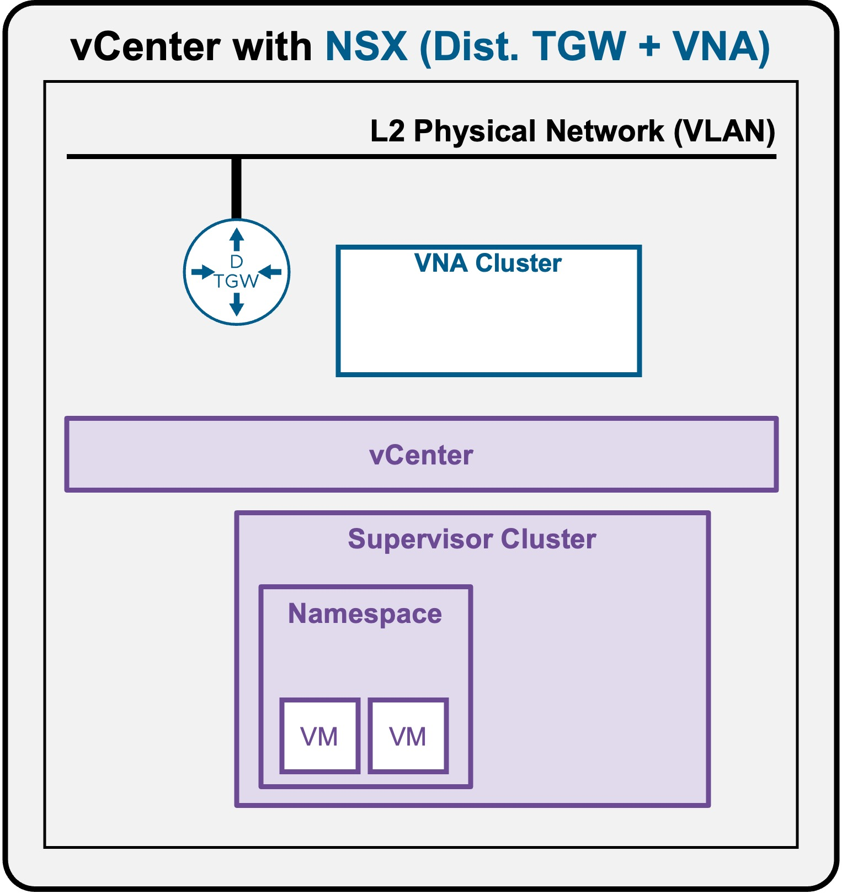
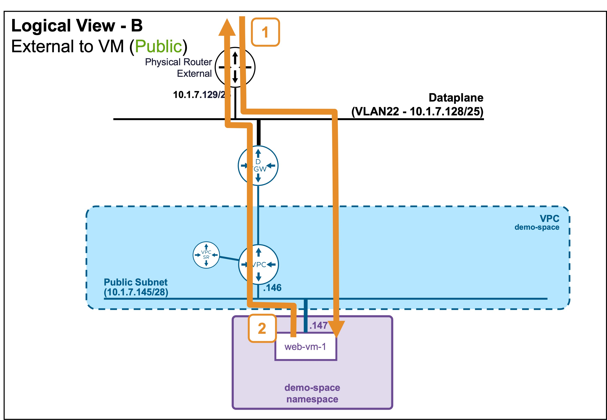
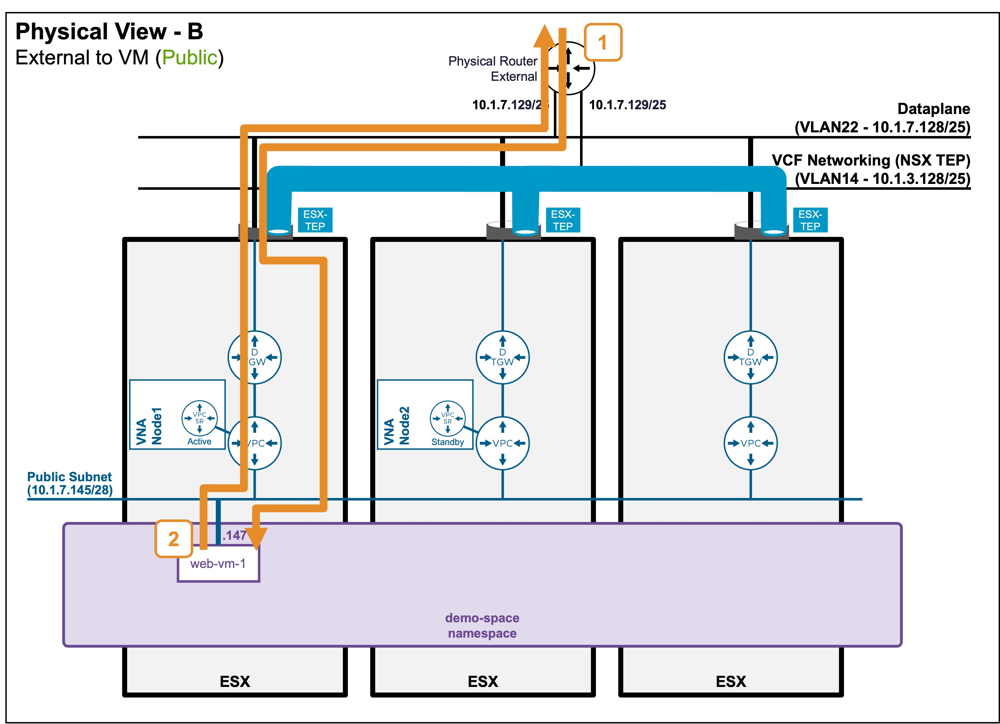

<h1>
   Supervisor with "NSX + DTGW/VNA"
</h1>

This section describes the procedures for **Troubleshooting Network Services into the VKS Namespace utilizing an "NSX + DTGW/VNA" architecture** inside a vSphere environment.

* **Packet Walk**  
    * [N/S External to VIP](2i1-packetwalk-ext_vip.md)  
    * [**N/S External to VM**](#packetwalk)  
    * [E/W Pod to Pod](2i3-packetwalk-pod_pod.md)  
    * [E/W VM to VM](2i4-packetwalk-vm_vm.md)  
* App Access Broken  
    * [VIP Access Down](2j1-troubleshooting-vip.md)  
    * [VM Access Down](2j2-troubleshooting-vm.md)  
    * [Pod Access Down](2j3-troubleshooting-pod.md)  

{ width="100%" }

---

## Packet Walk - N/S External to VM {: #packetwalk }

One or a few VMs have been deployed (see [Application Deployment > App Deployment (VMs) > via vCenter UI](2f1-deployment-vms.md#deployment_vms) or [Application Deployment > App Deployment (VMs) > via CLI](2f2-deployment-vms.md#deployment_vms)).

### View

#### Logical View
* **Scenario A: VM connected to Private Subnet (Private-VPC or Private-TGW)**  
{ width="75%" style="display: block; margin: 0 auto;" }
In this case, external clients can't reach that subnet, and so can't reach VMs on it.

* **Scenario B: VM connected to Public Subnet**  
{ width="75%" style="display: block; margin: 0 auto;" }

#### Physical View
* **Scenario B: VM connected to Public Subnet**  
{ width="95%" style="display: block; margin: 0 auto;" }

---

### Packet Walk

#### North/South: External Client to the VM

* **Step1: External Client accesses the VM**  
`Client-IP => VM1 (10.1.7.146)`  

    Traffic enters the  host where the VM resides.  
    Because the external Physical Router considers the VM to be on its local subnet, it forwards the traffic directly to the VM, completely bypassing the DTGW and VPC logical routers.

#### South/North: VM replies to the External Client

* **Step2: VM replies to the External Client**  
` VM1 (10.1.7.146) => Client-IP`  

    The return traffic follows a different path.  
    The VM sends the packet to its default gateway (VPC), which forwards it to its default gateway (DTGW), which finally routes it to the external Physical Router.

!!! info "Architectural Note: Asymmetric Routing & Hop Counts"
    As represented in the diagrams, the number of router hops differs between the inbound North/South path (Step 1) and the outbound South/North path (Step 2).  
    This asymmetric routing is completely transparent to the physical fabric and has no negative impact on data plane performance.  
    Crucially, this architecture is what enables optimized East/West VM-to-VM traffic, as detailed in the [Packet Walk - E/W VM to VM](2i4-packetwalk-vm_vm.md#packetwalk) section.
