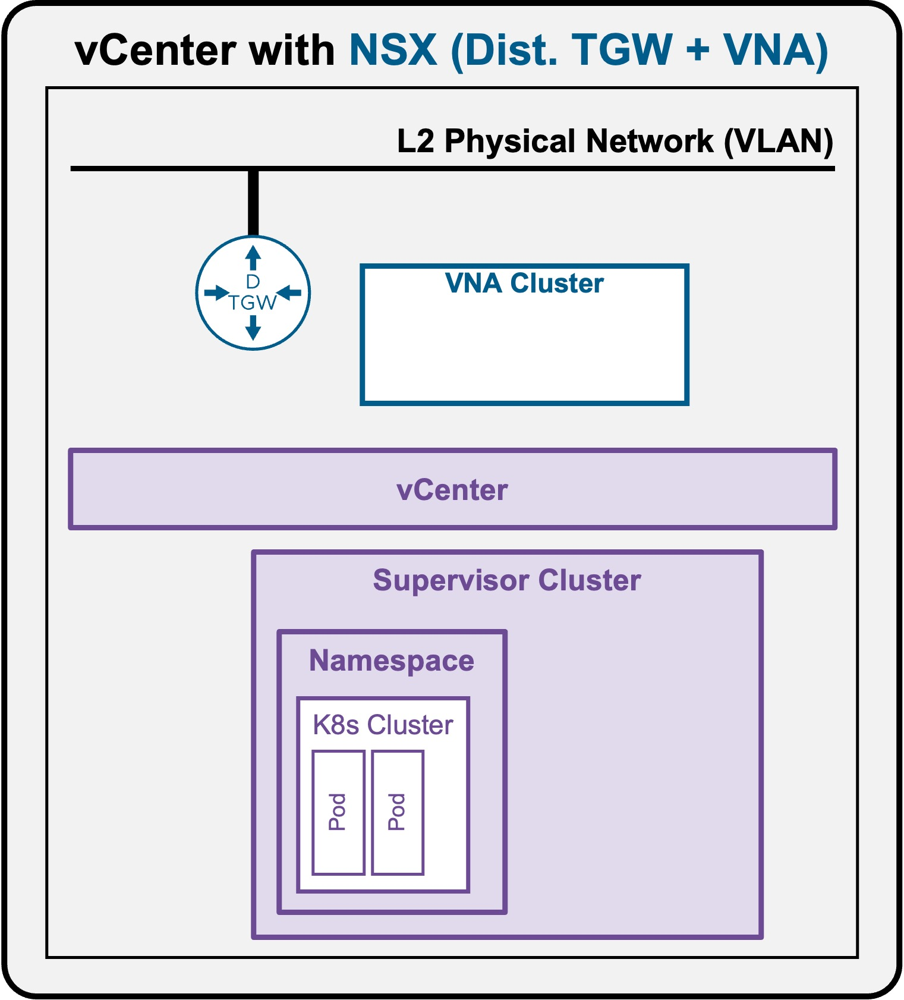
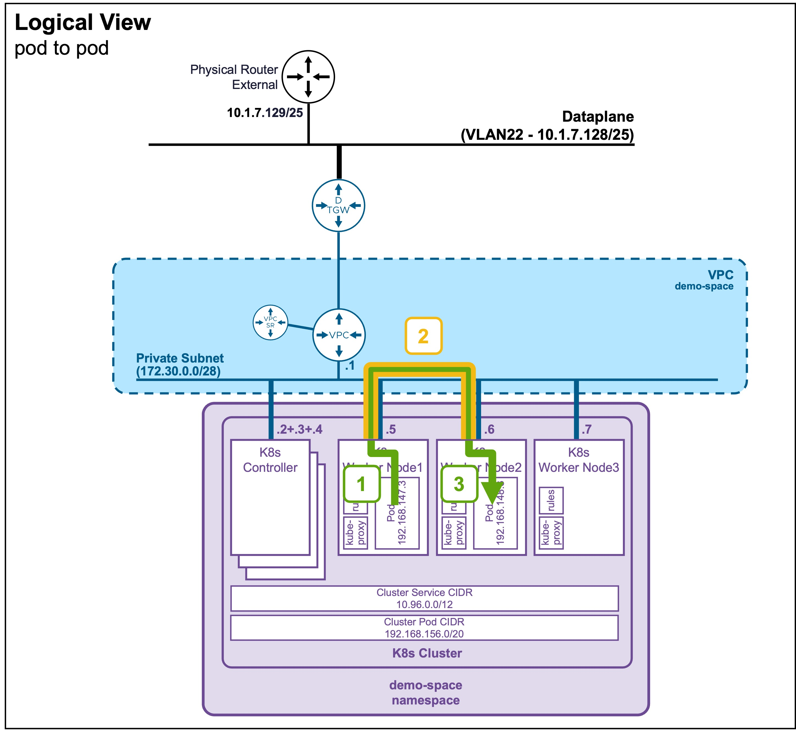
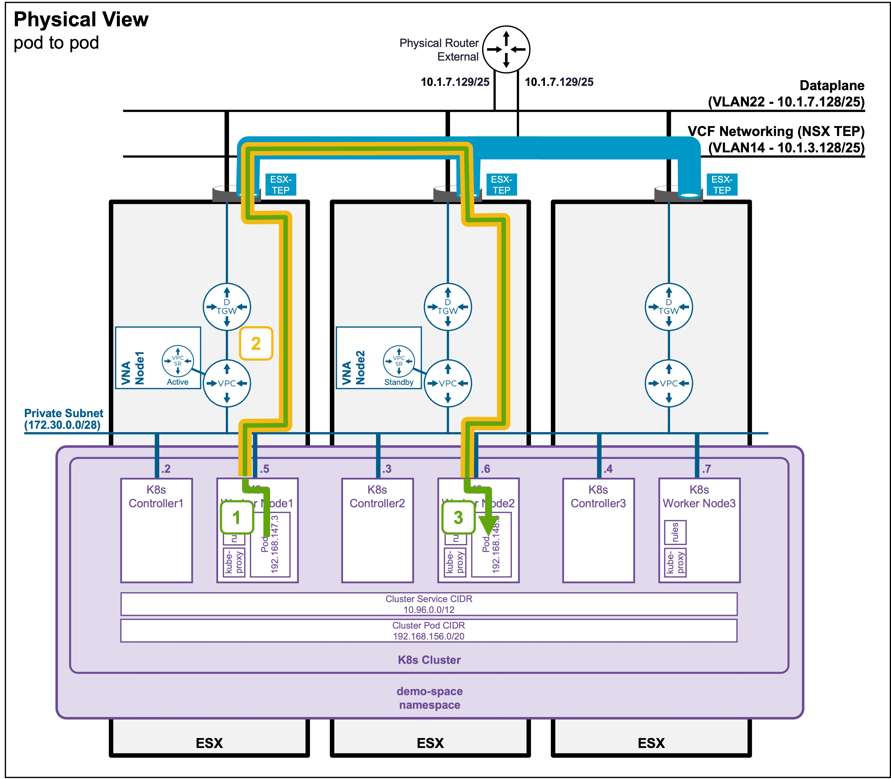

<h1>
   Supervisor with "NSX + DTGW/VNA"
</h1>

This section describes the procedures for **Troubleshooting Network Services into the VKS Namespace utilizing an "NSX + DTGW/VNA" architecture** inside a vSphere environment.

* **Packet Walk** 
    * [N/S External to VIP](2i1-packetwalk-ext_vip.md)  
    * [N/S External to VM](2i2-packetwalk-ext_vm.md)  
    * [**E/W Pod to Pod**](#packetwalk)  
    * [E/W VM to VM](2i4-packetwalk-vm_vm.md)  
* **App Access Broken**
    * [VIP Access Down](2j1-troubleshooting-vip.md)  
    * [VM Access Down](2j2-troubleshooting-vm.md)  
    * [Pod Access Down](2j3-troubleshooting-pod.md)  

{ width="100%" }

---

## Packet Walk - E/W pod to pod {: #packetwalk }

A Full Application (Load Balancer + Pods) has been deployed (see [Application Deployment > App Deployment (K8s) > via CLI](2g1-deployment-pods.md#deployment_pods)).

### View

#### Logical View
{ width="75%" style="display: block; margin: 0 auto;" }

#### Physical View
{ width="95%" style="display: block; margin: 0 auto;" }

---

### Packet Walk Explanation

* **Step 1: Traffic leaves the Source Pod**  
`Source-Pod-IP (192.168.147.3) => Destination-Pod-IP (192.168.148.3)`  

    The traffic exits the source pod and hits the Worker Node's local routing engine (managed by `kube-proxy` and the CNI agent, such as Antrea).  

* **Step 2: Cross-WorkerNode Encapsulation**  
<code>WorkerNode1-IP (172.30.0.5) => WorkerNode2-IP (172.30.0.6) 
&nbsp;&nbsp;[Source-Pod-IP (192.168.147.3) => Destination-Pod-IP (192.168.148.3)]
</code>

    Because the destination Pod resides on a different node, the source Worker Node encapsulates the original packet inside a node-to-node tunnel packet.  

    !!! note "Encapsulation for Cross-ESX Traffic"
        If the Worker Nodes reside on a different ESX host, the cross-ESX traffic undergoes a second layer of encapsulation using the ESX TEP IPs.  
        <code>ESX-TEP_IP (10.1.3.x) => ESX2-TEP_IP (10.1.3.x) 
        &nbsp;&nbsp;[WorkerNode1-IP (172.30.0.5) => WorkerNode2-IP (172.30.0.6)] 
        &nbsp;&nbsp;&nbsp;&nbsp;[[Source-Pod-IP (192.168.147.3) => Destination-Pod-IP (192.168.148.3)]]
        </code>

* **Step 3: Destination Node Decapsulation and Delivery**    
    `Source-Pod-IP (192.168.147.3) => Destination-Pod-IP (192.168.148.3)`

    The destination Worker Node receives the node-to-node packet and strips away the K8s encapsulation header.  
    The local routing rules then deliver the unencapsulated packet directly into the destination Pod's network interface.
    