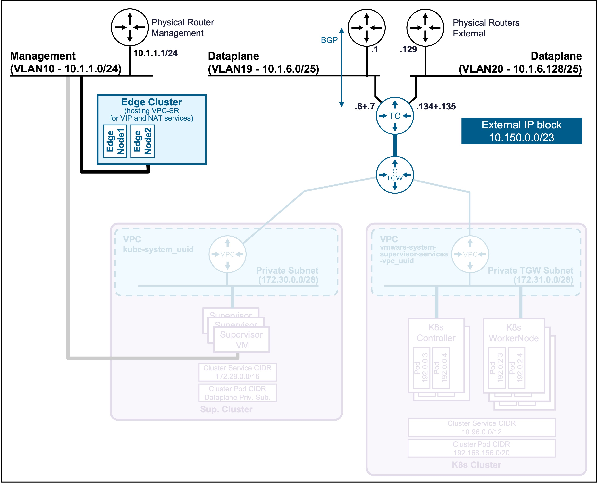
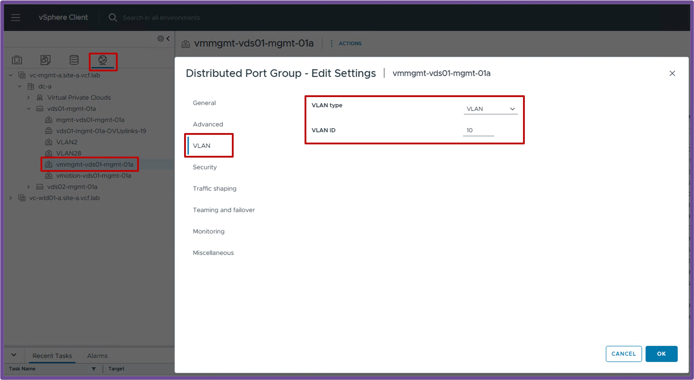
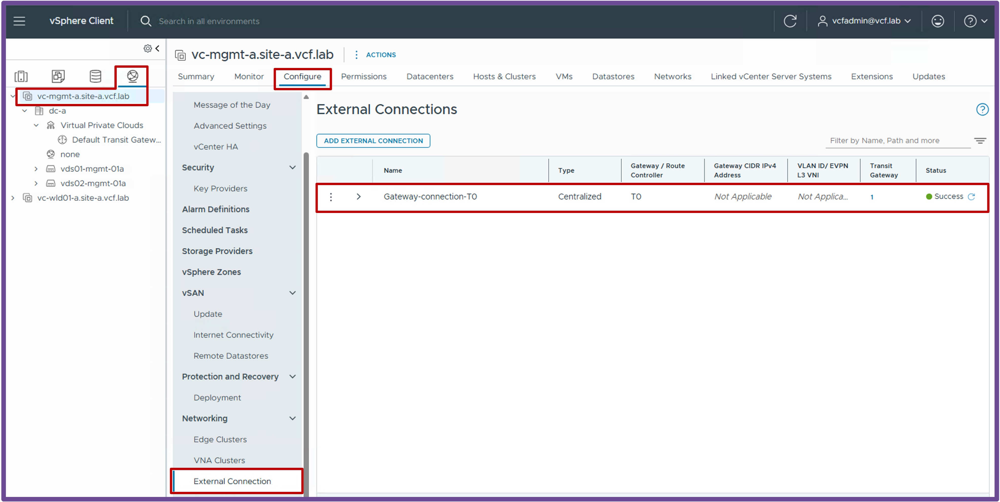
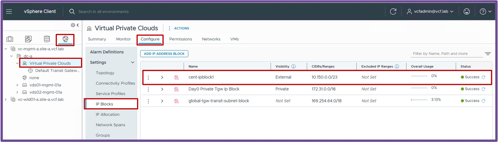
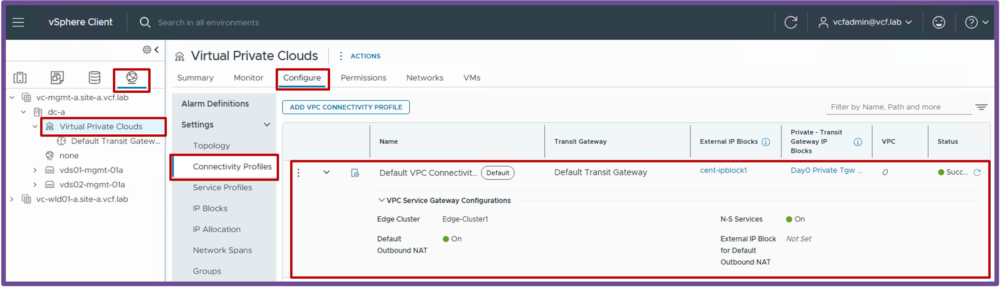
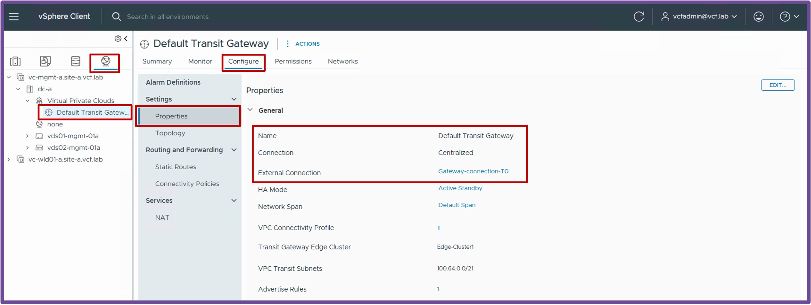

<h1>
   Supervisor with "NSX + CTGW/Edge/T0"
</h1>

This section describes the requirements for **deploying the Supervisor utilizing an "NSX + CTGW/Edge/T0" architecture** inside a vSphere environment.

* [**Requirements**](#requirements)
* Install Requirements
    * [NSX Overlay](3b1-deploy-NSXOverlay.md)
    * [CTGW + Edge + T0](3b2-deploy-CTGW_Edge_T0.md)

{ width="100%" }

---

## Requirements {: #requirements }

Supervisor with "NSX + CTGW/Edge/T0" has the following networking requirements:  

{ width="80%" style="display: block; margin: 0 auto;" }

### Physical Fabric {: #physical_fabric }

#### **1 Subnet/VLAN**  
* **Management**:  
    Can be an existing Management subnet/VLAN that already hosts other components (such as vCenter).  
    **Requires 5 consecutive IPs** (for the Supervisor Cluster).

#### **BGP Dynamic Routing Protocol**  
* **BGP configured between the physical routers and T0** with:  
    * The physical routers advertising themself as default gateway to the T0
    * The T0 advertising the future VPC Subnets public, VIP and NAT

---

### vCenter {: #vcenter }

#### **VDS Port Group**  
* **Management**:  
    VDS Port Group VLAN for the Management traffic.  

    ??? info "Status Validation"
        Navigate to **vCenter** > **Networking** > **VDS-PortGroup** > **Edit Settings** > **VLAN**.  
        Ensure the VLAN Type is "VLAN" with the right "VLAN ID":
        { width="95%" style="display: block; margin: 0 auto;" }

---

### NSX {: #nsx }

!!! warning "Missing NSX Requirements?"
    If your environment is not yet configured with the NSX prerequisites below, please refer to:  

    *  [Make vCenter Cluster "VCF Networking ready (NSX Overlay)"](2b1-deploy-NSXOverlay.md)
    *  [Make vCenter with "CTGW + Edge + T0 ready"](3b2-deploy-CTGW_Edge_T0.md)

#### **vCenter Cluster "VCF Networking ready (NSX Overlay)"**  
* **vCenter Cluster with NSX Prepared**  
    The vCenter Cluster must be prepared for VCF Networking so the future Supervisor Cluster can connect to the VPC.  

    ??? info "Status Validation"
        Navigate to **vCenter** > **Host and Clusters** > **[your vCenter Cluster]** > **Configure** > **Networking** > **Network Configuration**.  
        Ensure "Cluster Status" and "Host Status" are "Green", and ESX have at least 1 TEP IP Address:  
        > **Note:** If no workloads have been deployed on logical networks yet, it is normal to have zero tunnels established on the ESX hosts.  
    
        { width="95%" style="display: block; margin: 0 auto;" }

#### **vCenter with "CTGW + Edge + T0 ready"**  {: #ctgw-edge-t0-ready }

* **Edge Cluster**  
    The Edge Cluster hosts the Load Balancing and Outbound-NAT services (providing NAT for Supervisor / K8s Clusters communicating with the physical network).  

    ??? info "Status Validation"
        Navigate to **vCenter** > **Networking** > **vCenter** > **Configure** > **Networking** > **Edge Clusters**.  
        Ensure the Edge Cluster with its Nodes is deployed and shows a Green status.
        { width="95%" style="display: block; margin: 0 auto;" }

* **Centralized External Connection**  
    A Centralized External Connection is the VLAN and physical router used by logical networks (such as Transit Gateways and VPCs) to connect to the physical network.  

    ??? info "Status Validation"
        Navigate to **vCenter** > **Networking** > **vCenter** > **Configure** > **Networking** > **External Connection**.  
        Ensure you have at least 1 Centralized External Connection configured:
        { width="95%" style="display: block; margin: 0 auto;" }

* **IP Blocks**  
    The External IP Block is for the future K8s VIPs, VPC Outbound-NAT, and VPC Public Subnet (IP Block is the full Dataplane subnet or part of it).  

    ??? info "Status Validation"
        Navigate to **vCenter** > **Networking** > **Virtual Private Clouds** > **Configure** > **Settings** > **IP Blocks**.  
        Ensure you have at least 1 External IP Block configured:
        { width="95%" style="display: block; margin: 0 auto;" }

* **Connectivity Profile**  
    The Connectivity Profile binds the CTGW configuration (Edge Cluster, Outbound-NAT, and N-S Services for Load Balancing).  

    ??? info "Status Validation"
        Navigate to **vCenter** > **Networking** > **Virtual Private Clouds** > **Configure** > **Settings** > **Connectivity Profiles**.  
        Ensure the Connectivity Profile has the following configured:
        <ul style="margin-top: -5px; margin-bottom: 15px; line-height: 1.3;">
          <li style="margin-bottom: 2px;">External and Private Transit Gateway IP Blocks selected</li>
          <li style="margin-bottom: 2px;">An Edge Cluster selected</li>
          <li style="margin-bottom: 2px;">N-S Services enabled (for the LB service)</li>
          <li style="margin-bottom: 2px;">Default Outbound NAT enabled (for NAT)</li>
        </ul>
        { width="95%" style="display: block; margin: 0 auto;" }

* **Centralized Transit Gateway (CTGW)**  
    The Centralized Transit Gateway is the Centralized logical router responsible for routing traffic between the VPC(s) and Tier-0.  

    ??? info "Status Validation"
        Navigate to **vCenter** > **Networking** > **Default Transit Gateway** > **Configure** > **Settings** > **Properties**.  
        Ensure the CTGW has a Connection Type of "Centralized", and an External Connection configured. 
        { width="95%" style="display: block; margin: 0 auto;" }

* **Tier-0 (T0)**  
    The Tier-0 is the logical router responsible for routing traffic between the logical and physical networks.  

    ??? info "Status Validation"
        The T0 status is only available from NSX.  
        Navigate to **NSX** > **Networking** > **Tier-0 Gateways**.  
        Ensure the T0 has a Green status and no Alarms.
        { width="95%" style="display: block; margin: 0 auto;" }