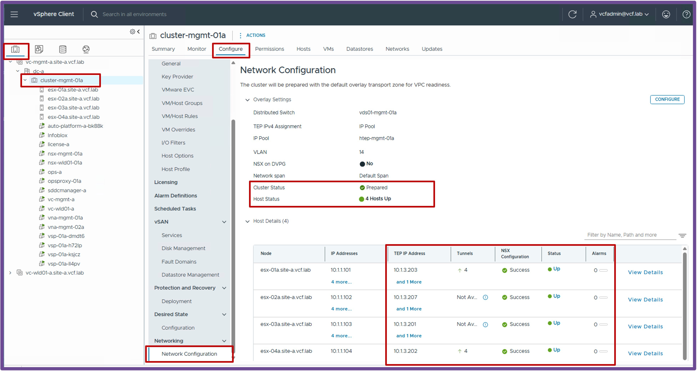

<h1>
   Supervisor with "NSX + CTGW/Edge/T0"
</h1>

This section describes the requirements for **deploying the Supervisor utilizing an "NSX + CTGW/Edge/T0" architecture** inside a vSphere environment.

* [Requirements](3a-requirements.md)
* **Install Requirements**
    * [**NSX Overlay**](#installation)
    * [CTGW + Edge + T0](3b2-deploy-CTGW_Edge_T0.md)

{ width="100%" }

---

## Installation {: #installation }

From VCF 9.0, all workload domains have NSX Overlay configured in vCenter Clusters.

---

### Validate NSX Overlay
 Navigate to **vCenter** > **Host and Clusters** > **[your vCenter Cluster]** > **Configure** > **Networking** > **Network Configuration**.  
Ensure "Cluster Status" and "Host Status" are "Green", and ESX have at least 1 TEP IP Address:  
*Note: If no workloads are deployed on logical networks yet, it is expected to have no Tunnels established on the ESX hosts.*
{ width="95%" style="display: block; margin: 0 auto;" }