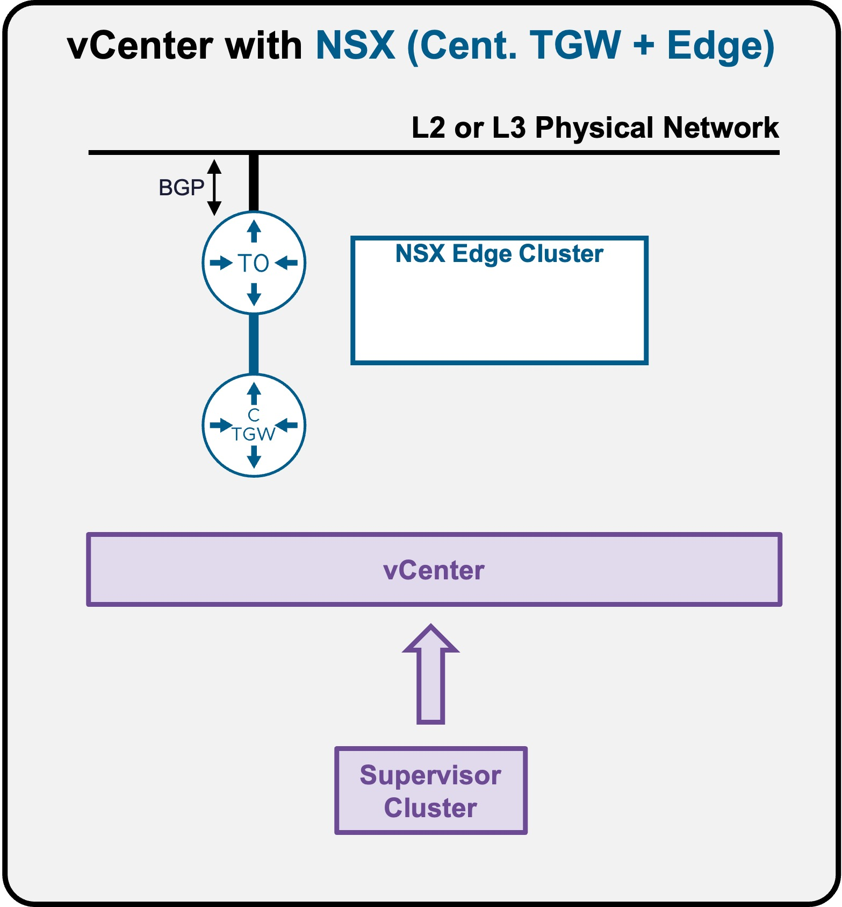
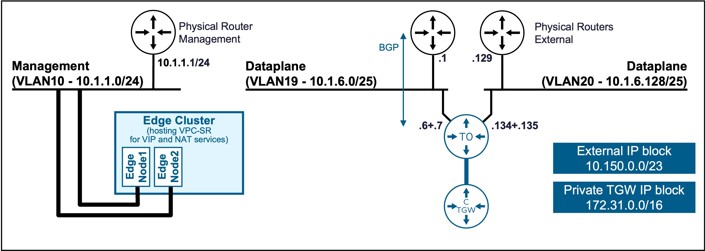
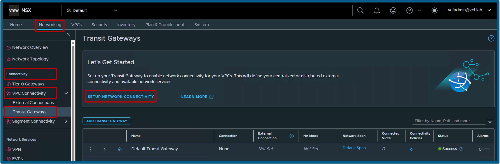

<h1>
   Supervisor with "NSX + CTGW/Edge/T0"
</h1>

This section describes the requirements for **deploying the Supervisor utilizing an "NSX + CTGW/Edge/T0" architecture** inside a vSphere environment.

* [Requirements](3a-requirements.md)
* **Install Requirements**
    * [NSX Overlay](3b1-deploy-NSXOverlay.md)
    * [**CTGW + Edge + T0**](#installation)

{ width="100%" }

---

## Install Requirements - CTGW + Edge + T0 {: #installation }

When no Transit Gateway has been deployed, NSX offers a simple wizard to deploy the CTGW + Edge + T0.

{ width="80%" style="display: block; margin: 0 auto;" }

### Launch "Setup Network Connectivity"

Navigate to **NSX** > **Networking** > **VPC Connectivity** > **Transit Gateways**.  
{ width="95%" style="display: block; margin: 0 auto;" }

!!! info "Deep Dive: Blogs & Video Demonstrations"
    * **Video Walkthrough:** Watch the step-by-step CTGW + Edge + T0 deployment [:fontawesome-brands-youtube: on YouTube](https://www.youtube.com/watch?v=ruoprGnf_v8){ target="_blank" }.
    * **Technical Blog:** Read the detailed architectural breakdown on the [:material-newspaper-variant-outline: VMware Cloud Foundation Blog](https://blogs.vmware.com/cloud-foundation/2025/06/25/vpc-centralized-network-connectivity-with-guided-edge-deployment/){ target="_blank" }.

---

### Validate Deployment
Once the wizard completes, verify the deployment was successful using the steps outlined in the prerequisites:  
**[Validate "CTGW + Edge + T0" Deployment](3a-requirements.md#ctgw-edge-t0-ready)**