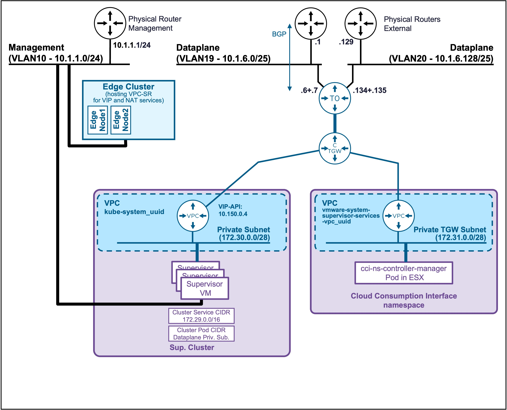
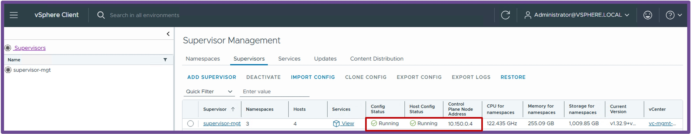

<h1>
   Supervisor with "NSX + CTGW/Edge/T0"
</h1>

<div class="grid" markdown style="grid-template-columns: 60% 40%">

<div markdown>

This section describes the requirements for **deploying a Supervisor Namespace utilizing an "NSX + CTGW/Edge/T0" architecture** inside a vSphere environment.

* **Supervisor**
    * [Deployment](3c1-deploy-supervisor.md)
    * [**Access via CLI**](#supervisoraccess)

</div>

<div markdown>
{ width="100%" }
</div>
</div>

---


## Supervisor Access {: #supervisoraccess }

{ width="80%" style="display: block; margin: 0 auto;" }

??? info ":material-laptop: Client Operating System"
    While the command outputs below are captured from a **Windows client**, the `vcf` and `kubectl` CLI tools operate identically across **Linux** and **macOS** environments.

### Connect to Supervisor {: #supervisorclient }

#### Find Supervisor Control Plane IP Address
Navigate to **vCenter** > **Supervisor Management** > **Supervisors**.  
{ width="95%" style="display: block; margin: 0 auto;" }

#### Connect to the Supervisor
From your K8s client:

* **Create once the VCF Context**  
    ```text
    vcf context create supervisor-mgt --endpoint=10.150.0.4 --type k8s --username administrator@vsphere.local --insecure-skip-tls-verify
    ```

    ??? abstract "Output example"
        <pre><code>PS C:\Users\Administrator\Documents> <b>vcf context create supervisor-mgt --endpoint=10.150.0.4 --type k8s --username administrator@vsphere.local --insecure-skip-tls-verify</b>
        [i] Some initialization of the CLI is required.
        [i] Let's set things up for you.  This will just take a few seconds.
        &nbsp;
        [i] Refreshing plugin inventory cache for "projects.packages.broadcom.com/vcf-cli/plugins/plugin-inventory:latest", this will take a few seconds.
        [i] Reading plugin inventory for "projects.packages.broadcom.com/vcf-cli/plugins/plugin-inventory:latest", this will take a few seconds.
        [i]
        [i] Initialization done!
        [i] ==
        [i] The vcf cli essential plugins have not been installed and are being installed now. The install may take a few seconds.
        [i] Installing plugins from plugin group 'vmware-vcfcli/essentials:v9.0.2'
        [i] Installed plugin 'telemetry:v9.0.2'
        &nbsp;
        [i] Auth type vSphere SSO detected. Proceeding for authentication...
        Provide Password: <b>VMware123!VMware123!</b>
        &nbsp;
        <b>Logged in successfully.</b>
        &nbsp;
        You have access to the following contexts:
          supervisor-mgt
          supervisor-mgt:svc-cci-ns-e3xwm
          supervisor-mgt:svc-tkg-ou5pn
          supervisor-mgt:svc-velero-z04hr
        &nbsp;
        If the namespace context you wish to use is not in this list, you may need to refresh the context again, or contact your cluster administrator.
        &nbsp;
        To change context, use vcf context use &lt;context_name&gt;
        [ok] successfully saved context: supervisor-mgt
        [ok] successfully saved context: supervisor-mgt:svc-cci-ns-e3xwm
        [ok] successfully saved context: supervisor-mgt:svc-tkg-ou5pn
        [ok] successfully saved context: supervisor-mgt:svc-velero-z04hr
        </code></pre>


* **Connect to the Supervisor**  

    ```text
    vcf context use supervisor-mgt
    ```

    ??? abstract "Output example"
        <pre><code>PS C:\Users\Administrator\Documents> <b>vcf context use supervisor-mgt</b>
        [ok] Token is still active. Skipped the token refresh for context "supervisor-mgt"
        [i] Successfully activated context 'supervisor-mgt' (Type: kubernetes)
        [i] Fetching recommended plugins for active context 'supervisor-mgt'...
        [i] Installing the following plugins recommended by context 'supervisor-mgt':
          NAME                INSTALLING
          addon               v3.6.1
          cluster             v3.6.1
          kubernetes-release  v3.6.1
          namespaces          v9.1.0
          package             v3.6.1
          registry-secret     v3.6.1
          vm                  v9.1.0
        [i] Installed plugin 'addon:v3.6.1'
        [i] Installed plugin 'cluster:v3.6.1'
        [i] Installed plugin 'kubernetes-release:v3.6.1'
        [i] Installed plugin 'package:v3.6.1'
        [i] Installed plugin 'registry-secret:v3.6.1'
        </code></pre>


---

### Validate Supervisor Access

* **Validate Supervisor Connection**  

    ```text
    vcf context list
    ```

    ??? abstract "Output example"
        <pre><code>PS C:\Users\Administrator\Documents> <b>vcf context list</b>
        NAME                             CURRENT  TYPE
        <b>supervisor-mgt                   true     kubernetes</b>
        supervisor-mgt:svc-cci-ns-e3xwm  false    kubernetes
        supervisor-mgt:svc-tkg-ou5pn     false    kubernetes
        supervisor-mgt:svc-velero-z04hr  false    kubernetes
        &nbsp;
        [i] Use '--wide' to view additional columns.
        </code></pre>

* **Validate the access to the Supervisor Namespace context**  
    To test the connection, you can check the worker nodes on that Supervisor (these are the ESX hosts).
    ```text
    kubectl get nodes
    ```

    ??? abstract "Output example"
        <pre><code>PS C:\Users\Administrator\Documents> <b>kubectl get nodes</b>
        NAME                               STATUS   ROLES                  AGE   VERSION
        421f0786a120cf2c9c6b5d01ee31004b   Ready    control-plane,master   2d    v1.32.9+vmware.2-fips
        esx-01a.site-a.vcf.lab             Ready    agent                  2d    v1.32.5-sph-f4e887d
        esx-02a.site-a.vcf.lab             Ready    agent                  2d    v1.32.5-sph-f4e887d
        esx-03a.site-a.vcf.lab             Ready    agent                  2d    v1.32.5-sph-f4e887d
        esx-04a.site-a.vcf.lab             Ready    agent                  2d    v1.32.5-sph-f4e887d
        </code></pre>