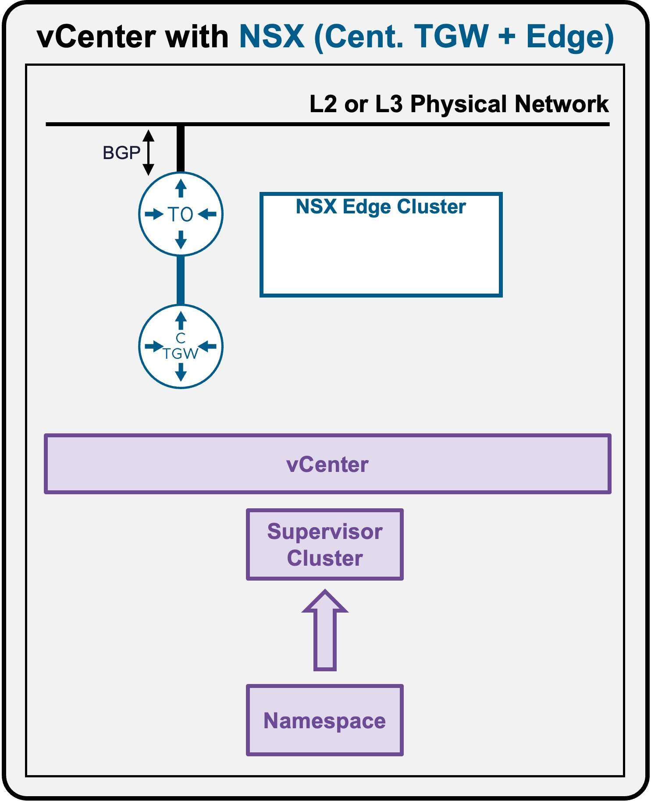
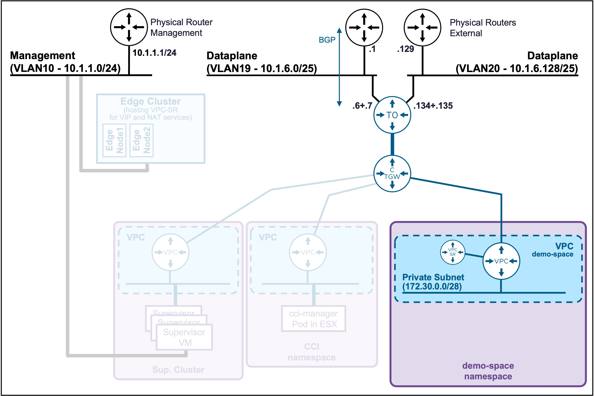

<h1>
   Supervisor with "NSX + CTGW/Edge/T0"
</h1>

<div class="grid" markdown style="grid-template-columns: 60% 40%">

<div markdown>

This section describes the requirements for **deploying the Supervisor Namespace utilizing an "NSX + CTGW/Edge/T0" architecture** inside a vSphere environment.

* **Namespace**
    * [Deployment](3d1-deploy-namespace.md)
    * [**Access via CLI**](#namespaceaccess)

</div>

<div markdown>
{ width="100%" }
</div>
</div>

---


## Namespace Access {: #namespaceaccess }

{ width="80%" style="display: block; margin: 0 auto;" }

??? info ":material-laptop: Client Operating System"
    While the command outputs below are captured from a **Windows client**, the `vcf` and `kubectl` CLI tools operate identically across **Linux** and **macOS** environments.

### Connect to Namespace {: #namespacek8sclient }

#### Connect to the Supervisor
See [Supervisor Access](3c2-access-supervisor.md#supervisoraccess)

#### Connect to the Supervisor Namespace

* **List the Supervisor Namespaces**  
    ```text
    vcf context list
    ```

    ??? abstract "Output example"
        <pre><code>PS C:\Users\Administrator\Documents> <b>vcf context list</b>
        NAME                             CURRENT  TYPE
        <b>supervisor-mgt                   true    kubernetes</b>
        supervisor-mgt:demo-space        false     kubernetes
        supervisor-mgt:svc-cci-ns-e3xwm  false    kubernetes
        supervisor-mgt:svc-tkg-ou5pn     false    kubernetes
        supervisor-mgt:svc-velero-z04hr  false    kubernetes
        </code></pre>

        If the namespace has been created recently (after the Supervisor connection), it may not be listed.  
        In that case, refresh the context list:
        <pre><code>PS C:\Users\Administrator\Documents> <b>vcf config set env.VCF_CLI_CONTEXT_REFRESH_EXPIRY_CHECK_SKIP true</b>
        PS C:\Users\Administrator\Documents> <b>vcf context refresh</b>
        </code></pre>

* **Connect to the Supervisor Namespace**  
    ```text
    vcf context use supervisor-mgt:demo-space
    ```

    ??? abstract "Output example"
        <pre><code>PS C:\Users\Administrator\Documents> <b>vcf context use supervisor-mgt:demo-space</b>
        [ok] Token is still active. Skipped the token refresh for context "supervisor-mgt:demo-space"
        [i] Successfully activated context 'supervisor-mgt:demo-space' (Type: kubernetes)
        [i] Fetching recommended plugins for active context 'supervisor-mgt:demo-space'...
        [i] Installing the following plugins recommended by context 'supervisor-mgt:demo-space':
          NAME                INSTALLING
          addon               v3.6.1
          cluster             v3.6.1
          kubernetes-release  v3.6.1
          namespaces          v9.1.0
          package             v3.6.1
          registry-secret     v3.6.1
          vm                  v9.1.0
        [i] Installed plugin 'addon:v3.6.1'
        [i] Installed plugin 'cluster:v3.6.1'
        [i] Installed plugin 'kubernetes-release:v3.6.1'
        [i] Installed plugin 'package:v3.6.1'
        [i] Installed plugin 'registry-secret:v3.6.1'
        </code></pre>

---

### Validate Namespace Access

#### Validate the current Supervisor Namespace Connection

```text
vcf context list
```

??? abstract "Output example"
    <pre><code>PS C:\Users\Administrator\Documents> <b>vcf context list</b>
      NAME                             CURRENT  TYPE
      supervisor-mgt                   false    kubernetes
      <b>supervisor-mgt:demo-space        true     kubernetes</b>
      supervisor-mgt:svc-cci-ns-e3xwm  false    kubernetes
      supervisor-mgt:svc-tkg-ou5pn     false    kubernetes
      supervisor-mgt:svc-velero-z04hr  false    kubernetes
    &nbsp;
    [i] Use '--wide' to view additional columns.
    </code></pre>

#### Validate the access to the Supervisor Namespace context  

To test the connection, you can check the worker nodes on that Supervisor Namespace (these are the ESX hosts).
```text
kubectl get nodes
```

??? abstract "Output example"
    <pre><code>PS C:\Users\Administrator\Documents> <b>kubectl get nodes</b>
    NAME                               STATUS   ROLES                  AGE   VERSION
    421f0786a120cf2c9c6b5d01ee31004b   Ready    control-plane,master   2d    v1.32.9+vmware.2-fips
    esx-01a.site-a.vcf.lab             Ready    agent                  2d    v1.32.5-sph-f4e887d
    esx-02a.site-a.vcf.lab             Ready    agent                  2d    v1.32.5-sph-f4e887d
    esx-03a.site-a.vcf.lab             Ready    agent                  2d    v1.32.5-sph-f4e887d
    esx-04a.site-a.vcf.lab             Ready    agent                  2d    v1.32.5-sph-f4e887d
    </code></pre>