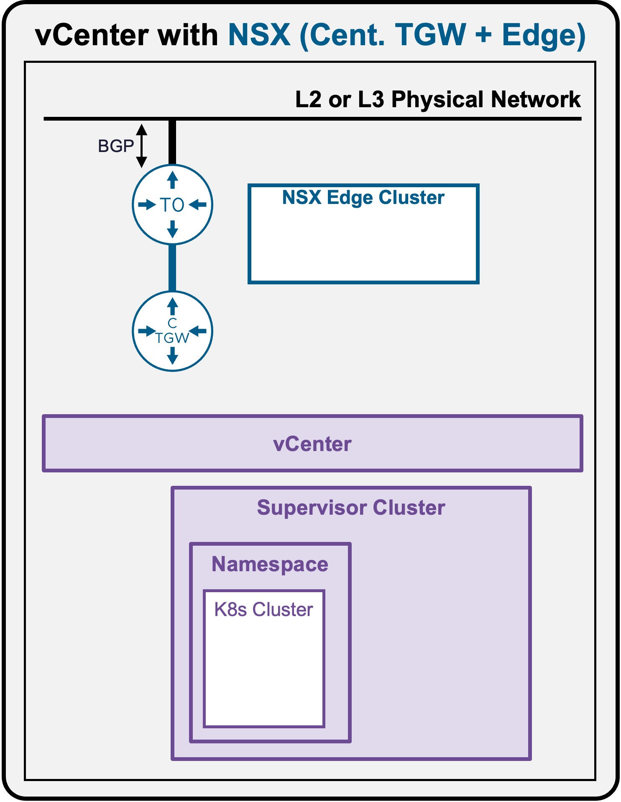
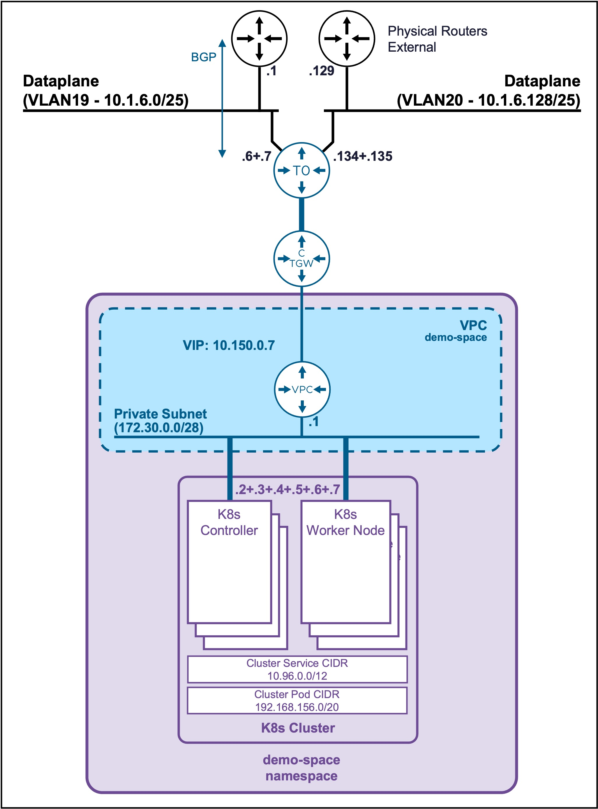
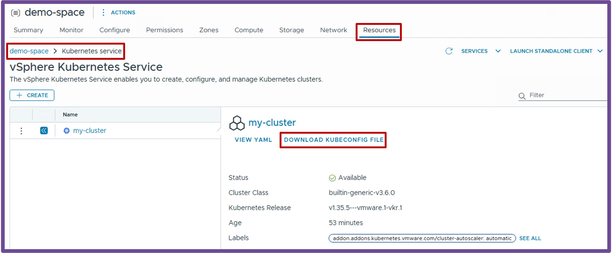

<h1>
   Supervisor with "NSX + CTGW/Edge/T0"
</h1>

<div class="grid" markdown style="grid-template-columns: 60% 40%">

<div markdown>

This section describes the procedures for **deploying a K8s Cluster in a Namespace utilizing an "NSX + CTGW/Edge/T0" architecture** inside a vSphere environment.

* **K8s Cluster**
    * [Deployment via vCenter UI](3e1-deployment-k8s.md)
    * [Deployment via CLI](3e2-deployment-k8s.md)
    * [**Access via CLI**](#access_k8s)

</div>

<div markdown>
{ width="100%" }
</div>
</div>

---

##  K8s Cluster Access {: #access_k8s }

{ width="60%" style="display: block; margin: 0 auto;" }

??? info ":material-laptop: Client Operating System"
    While the command outputs below are captured from a **Windows client**, the `vcf` and `kubectl` CLI tools operate identically across **Linux** and **macOS** environments.

### Connect to K8s Cluster {: #connect_k8s }

#### Retrieve K8s Kubeconfig file
* **Option1 vCenter UI**  
Download the K8s Cluster kubeconfig file **"my-cluster-kubeconfig.yaml"** navigating to **vCenter** > **Supervisor Management** > **Supervisors**, select **[your supervisor]**, navigate to **Namespaces**, select **[your namespace]**, navigate to **Resources**, click on **Kubernetes - Go to Service**, click on **Download Kubeconfig File**.

{ width="70%" style="display: block; margin: 0 auto;" }


* **Option2 CLI**  
    Create the K8s Cluster kubeconfig file **"my-cluster-kubeconfig.yaml"**.
    <pre><code>[System.IO.File]::WriteAllBytes("$pwd\my-cluster-kubeconfig.yaml", [System.Convert]::FromBase64String((kubectl get secret <b>my-cluster-kubeconfig</b> -n <b>demo-space</b> -o jsonpath='{.data.value}')))</code></pre>

    ??? abstract "Output example"
        <pre><code>PS C:\Users\Administrator\Documents> <b>[System.IO.File]::WriteAllBytes("$pwd\my-cluster-kubeconfig.yaml", [System.Convert]::FromBase64String((kubectl get secret my-cluster-kubeconfig -n demo-space -o jsonpath='{.data.value}')))</b>
        </code></pre>

??? info "File "my-cluster-kubeconfig.yaml" created"
    ```text
    apiVersion: v1
    clusters:
    - cluster:
        certificate-authority-data: LS0tLS1CRUdJTiBDRVJUSUZJQ0FURS0tLS0tCk1JSUM2akNDQWRLZ0F3SUJBZ0lCQURBTkJna3Foa2lHOXcwQkFRc0ZBREFWTVJNd0VRWURWUVFERXdwcmRXSmwKY201bGRHVnpNQjRYRFRJMk1EZ3dOVEl5TXpjMU1sb1hEVE0yTURnd01qSXlOREkxTWxvd0ZURVRNQkVHQTFVRQpBeE1LYTNWaVpYSnVaWFJsY3pDQ0FTSXdEUVlKS29aSWh2Y05BUUVCQlFBRGdnRVBBRENDQVFvQ2dnRUJBTWF4Ci9kcXZta2w0U0FFRFgzY3FHcElObkV5UkRzNXJHaVJ1NVI1dWJ5U2J0Z2ZkcjgwWGRMU2xqOVdYSzFGOFZTZysKamFqekwycndQTTh4SlpSYzROU2o5dHdHWXZEOW1vbEx3Q0FSYlNCbllRTTVRWTZQci9WTlRWNkM2VlhkWWU3TApkT1FNWFFiL2lMQ29IK2RyRGVHZTFsQzZyVGNHMWRkY3dzZDNRV25wNmEwQVg1WE5VUi9HZndMTVMvZ1hFdzBkCk1vZkRoc2RnOEdjaXA3TmdkMWxMRVd6RGN4V1cweWpUZ1p3bElBSXRmbVZETVVXcVNSaW9KVXJGM2dKck9LUEUKbFplRy9qNmcwdVN2RThMS29MSGwzeHEybmlKY3dzUDgzRDNhbkd5eG9tVU9oRHhZYUt3cEp5VmlxUzFRc1dKRwozWi9ITEd6K1ZrbXE1bmtoRWZNQ0F3RUFBYU5GTUVNd0RnWURWUjBQQVFIL0JBUURBZ0trTUJJR0ExVWRFd0VCCi93UUlNQVlCQWY4Q0FRQXdIUVlEVlIwT0JCWUVGSC9kdHhMMWZIbTBpSmU0VjBWTjNUWTlvaTF2TUEwR0NTcUcKU0liM0RRRUJDd1VBQTRJQkFRQlJueFdDTlMzNU9EbG5ZQkVzZVpha3JXYmJCZW1xUFdhcHBXb21CVWt5Z1p1SApyZkcyeFBkUGdOdU5qb0F4bUM4UC9HTWI5cEJKbW5Xc0t3M0Nidkh3SDBFbTR6RHRob2JxTGk1TTlLSU0ydlI3CjBuR1FyZ0JtTmdxdWhTaDArUUF1SVdRWVdsZlY2Ym9nYmlRT3VLNVd4eGN0L3hLbmk2ekp4Y1RLd2RxQjJ4Y2IKUzZUamdMNVpnbm9JQW4wc2ZqYnljM3g3ekc0NW5xcFY5Z0JOL2t2SC9mMlVHekJLODIzbjR5eDQ0OFM4SHovUwo4MCtSQnlIVXcxUUZzcWh3bUU5L2ZJSG13Snc0WVpwa1hhSzZ0Q1drdnlUQW5RMlNFY0NLT2MxdFhNbW5hR2djClFBUTVsZ1RBdzRyWEg1WGJ5Zk5zZmdWdVh3bmZHakdsM2twTmRleDcKLS0tLS1FTkQgQ0VSVElGSUNBVEUtLS0tLQo=
        server: https://10.150.0.8:6443
      name: my-cluster
    contexts:
    - context:
        cluster: my-cluster
        user: my-cluster-admin
      name: my-cluster-admin@my-cluster
    current-context: my-cluster-admin@my-cluster
    kind: Config
    users:
    - name: my-cluster-admin
      user:
        client-certificate-data: LS0tLS1CRUdJTiBDRVJUSUZJQ0FURS0tLS0tCk1JSURFekNDQWZ1Z0F3SUJBZ0lJSFZwamlMeGI5K2d3RFFZSktvWklodmNOQVFFTEJRQXdGVEVUTUJFR0ExVUUKQXhNS2EzVmlaWEp1WlhSbGN6QWVGdzB5TmpBNE1EVXlNak0zTlRKYUZ3MHlOekE0TURVeU1qUXlOVFJhTURReApGekFWQmdOVkJBb1REbk41YzNSbGJUcHRZWE4wWlhKek1Sa3dGd1lEVlFRREV4QnJkV0psY201bGRHVnpMV0ZrCmJXbHVNSUlCSWpBTkJna3Foa2lHOXcwQkFRRUZBQU9DQVE4QU1JSUJDZ0tDQVFFQTFCVE5jWi9XZDJ1YW9sanEKVno5WlM2K08walNsVlYvVlQyRWEyUGJKUU1wZFp6OFd1aFIyT21XRUZreTl1ZG12UTJrTVBJdnJNVjU1bnNTaQpaMHpkS0VMRnlkdGVDajkvL1ZiSjUxWWprRWFMclMwaVFBd3hkcVhiZlZxdjMxWDF3UVZLaUE2Z1I0eDdCc1BoCkl1MGc5VjBmb0NzUXliWXdZZDRqbzZXNEs2TXhOVG1maFR0Si92QWN3V3ZJbEhjS0RhbGgrRVdPNkdqekJEUFAKai9EanZhdEJYMGxUaU16ODNVRHRRamhHMmVxc01ud1VaTlpUZ0w2eWFsVGNlbTdRL1lGNkN4VDNKdERGTFVMRAptNXN3MytjU0FUN3plVzc3VmtEYnBsUGRYZWpJQnRKa3kyam9ZU1ZrL0hCdzhiUmlmZGdieERxa2lnakZGYjNOCjZ5Rit4d0lEQVFBQm8wZ3dSakFPQmdOVkhROEJBZjhFQkFNQ0JhQXdFd1lEVlIwbEJBd3dDZ1lJS3dZQkJRVUgKQXdJd0h3WURWUjBqQkJnd0ZvQVVmOTIzRXZWOGViU0lsN2hYUlUzZE5qMmlMVzh3RFFZSktvWklodmNOQVFFTApCUUFEZ2dFQkFIbm9FYU45WE9sUzNzMFhrdm9zQWJWU2dsWWJKYTcydEFQNWR3eDZ3eWdWS2JTdjQyN01ta21NCkxRZC84U0RjdVJzK0s3VnFsbHl6S2t3a2xKSEIyaUZHT3cwNDc3cWtPaHpIY3lUQTl3NU1qRXBFR2ErWTladWsKQ1VHemFSS1ltQmVMcytEYW9URTArT01kbThzcm53SUVlVWRiWFU1dTVnK1c5a3Q1T3ZmQ1RGQ2dYVUFSdzE2Qwo2YUZYK2RNUnpWLzl2QVdva2VjKzBpYW1sS2hKbCtMc25PaGdMcTJtRXBKOWFyMzRRMU54ejZtbFI1ZnhLRGZRCm8xd20yVmx0U0R1U2NSVFZRV0RpT2JBYVQ4V0NDL1o4SjRiVERYK2pyaWZKdmhlZ3Q3Q0RZVTFwMjFNVFBNUjYKMnNVbWp3c3VQNGE0SzJDN0RmaFdZUzhDazhOZk1pTT0KLS0tLS1FTkQgQ0VSVElGSUNBVEUtLS0tLQo=
        client-key-data: LS0tLS1CRUdJTiBSU0EgUFJJVkFURSBLRVktLS0tLQpNSUlFcFFJQkFBS0NBUUVBMUJUTmNaL1dkMnVhb2xqcVZ6OVpTNitPMGpTbFZWL1ZUMkVhMlBiSlFNcGRaejhXCnVoUjJPbVdFRmt5OXVkbXZRMmtNUEl2ck1WNTVuc1NpWjB6ZEtFTEZ5ZHRlQ2o5Ly9WYko1MVlqa0VhTHJTMGkKUUF3eGRxWGJmVnF2MzFYMXdRVktpQTZnUjR4N0JzUGhJdTBnOVYwZm9Dc1F5Yll3WWQ0am82VzRLNk14TlRtZgpoVHRKL3ZBY3dXdklsSGNLRGFsaCtFV082R2p6QkRQUGovRGp2YXRCWDBsVGlNejgzVUR0UWpoRzJlcXNNbndVClpOWlRnTDZ5YWxUY2VtN1EvWUY2Q3hUM0p0REZMVUxEbTVzdzMrY1NBVDd6ZVc3N1ZrRGJwbFBkWGVqSUJ0SmsKeTJqb1lTVmsvSEJ3OGJSaWZkZ2J4RHFraWdqRkZiM042eUYreHdJREFRQUJBb0lCQUdEbFFqb01HNG9ETlNyQQpjZ3k3cWpvY3N5V1NIUW5GRjZuRlJXVmtWMjNOSjJDUkgvcVRkN0xWaDhSQ2VwcHJmUnBRNStEUDBueURYQkN3CmFUekdEdk1pa3NoWGUvODFwTzNqMWFwbW5pZ0FPemU3ZTc4RWN5THd3emZpRTZGMzNpaTZtS05SLzJQQktNSmUKQTBJWVVpc1lTV2M5MWRVNjhwNzhSWTh5bTFML3psQVRzVHU3SnEzZExhckJOOWg0czBsRThZUjNNQ053MVV2cQo4TmJRUnVQdzNXVFRENCtzVURVWUVYODFnZGVPMHM5L0d1Ri80ZXFIUVdVTUhtRExjaDA5QllSeU1rTjdtcklOCmtoY1U0NytxNmNWaXVzQW5ReE0rYnJKdlRTNy9DRkJoNVAzMWcrV0Y5VCs5aGJ1ZSt2clE5NHQ4VFIyM3NYb2oKSFVMUnc2MENnWUVBL01JWjhVUldYK291M2pIY2dySEp6b2xkYzlJNGlxZGNEd1BMRnpsZ3NLd042WDFiNTNBeQp2cVc2OGNVMDB4WldldVBpMVJnREtScHZad1Q5dFJJVzVia20vNFhzMFJaaFF4dGdic0JzcnZyNGJ3U3dibGpMCk96L0N0V3dRR1F1NzZOVlp4RkdlRGpZdER3dVl4WFphL1lFcG9wQnhadExUNitUOXVsMnh4UDBDZ1lFQTFzMGsKeW04Y1ZyV2NTczhQTmN3clRmRVNubmw5ZGk2ckw4blh2R29IcmhvSXJxS0tTZ3BpcVk0ZDZoWllHU2hqSUh1VApQT1I0RUphNzRHbzJzeWhrbmJwZlkyS0hWTGZ2TE4zRVd0eHVHeDh5ZDJYRDZvaFBKaDdEdWpxSnp6Z25BUXZ0CmR0R0lxVmsvSlh6aWNtNit2ZlB3bllKVFBLbnpwRzFpVm82bFlCTUNnWUVBNFhIam44NDdXSXZSeUFBalZqTnIKOUJ1VHpsWElkdXUxOGZLSk9DckdjbTdVYmRtUm1zbjVpUkRid1FBTUVPZVF0VVlFTWR1Y0hoSmxJVGRUY0NrMQpZU3VYZkR5aE1SSE1LUVlIS21IWnp1MHRvQ0JIbWZUN09OcXpPZ3lzQXhyelBVYm5MWE03RGlRR1pyQUtVTDR6CmhIK3Jla05wMHJQanNEbHNrc2sxWWFVQ2dZRUFpcXVUVmREWFphOEhBRkNlVENmTHlSeVozWThuRE5YaUZBN2wKWkxDNjFvM2VEd2ZGNlRpOUt5TWhjczhML3VuUTNOYUtYbVJNa3NFTTl6cjZwenlyZ0J3aW1xR3dKbVE4VnlXdwpMc3hobE1iV0tMaWMrMXNXWmRDMG9SUkxoV2lGM2FvYW1udDVFNE1YUGhkYWhXK3pXaVFTc1V6Q2VjWnFFVHZBCm9ZcWpmdHNDZ1lFQTZodmovSlBkVFZpQjNnaW1XSGFyWFozbWJTSDVobHZta25ERVZJcmhUT2lENFFTOG1VWWcKUWZZN3daQ3F6RTg1UHlRWVVjaGNpU2xIY3l0UnZrc05NTXo3WU5IZHltREoxTm5RSy9SaVFZQ3V3NFdHdHg5QwpDU3plVkZUN0hNK2FhMTV2UlhRcS91OUs1ZGhobVpBRVNxSktXZFB3Q0hoRi9uMSt4alhiRGF3PQotLS0tLUVORCBSU0EgUFJJVkFURSBLRVktLS0tLQo=
    ```

#### Connect to the K8s Cluster

* **Create KUBECONFIG variable**
    ```text
    $env:KUBECONFIG="$pwd\my-cluster-kubeconfig.yaml"
    ```

    ??? abstract "Output example"
        <pre><code>PS C:\Users\Administrator\Documents> <b>$env:KUBECONFIG="$pwd\my-cluster-kubeconfig.yaml"</b>
        </code></pre>
        Note: To connect back to the Supervisor Namespace (such as "demo-space")
        <pre><code>PS C:\Users\Administrator\Documents> <b>$env:KUBECONFIG = $null</b>
        </code></pre>

* **Change context to the K8s Cluster**
    ```text
    kubectl config use-context my-cluster-admin@my-cluster
    ```

    ??? abstract "Output example"
        <pre><code>PS C:\Users\Administrator\Documents> <b>kubectl config use-context my-cluster-admin@my-cluster</b>
        Switched to context "my-cluster-admin@my-cluster".
        </code></pre>


---

### Validate Namespace Access

#### Validate Context is the K8s Cluster
```text
kubectl config get-contexts
```

??? abstract "Output example"
    The current context is:  
    . **Cluster: my-cluster**  
    . **Namespace: default (empty)**  
    <pre><code>PS C:\Users\Administrator\Documents> <b>kubectl config get-contexts</b>
    CURRENT   NAME                          CLUSTER      AUTHINFO           NAMESPACE
    *         my-cluster-admin@my-cluster   my-cluster   my-cluster-admin
    </code></pre>

#### Validate K8s Cluster connection
```text
kubectl get nodes
```

??? abstract "Output example"
    <pre><code>PS C:\Users\Administrator\Documents> <b>kubectl get nodes</b>
    NAME                                   STATUS   ROLES           AGE   VERSION
    my-cluster-lr2wr-846xb                 Ready    control-plane   49m   v1.35.5+vmware.1
    my-cluster-lr2wr-jg9d2                 Ready    control-plane   47m   v1.35.5+vmware.1
    my-cluster-lr2wr-mszdm                 Ready    control-plane   45m   v1.35.5+vmware.1
    my-cluster-workers-8nzn6-92xvh-68x8b   Ready    <none>          48m   v1.35.5+vmware.1
    my-cluster-workers-8nzn6-92xvh-chjkb   Ready    <none>          48m   v1.35.5+vmware.1
    my-cluster-workers-8nzn6-92xvh-ksg87   Ready    <none>          48m   v1.35.5+vmware.1
    </code></pre>

