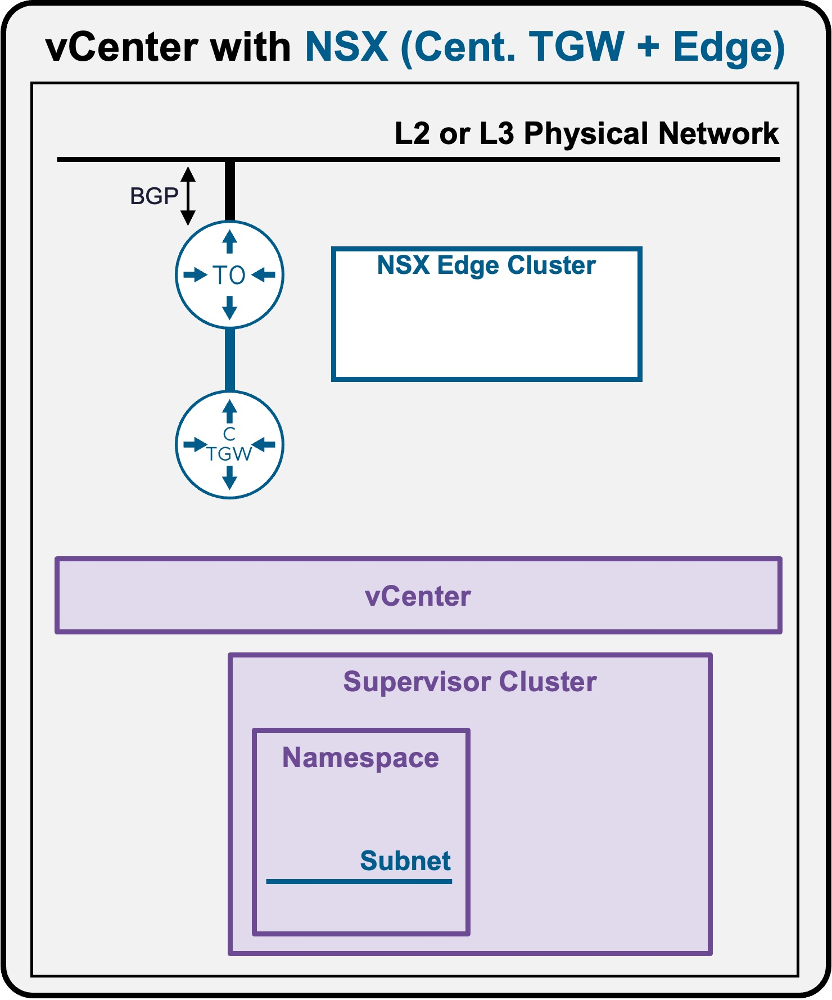
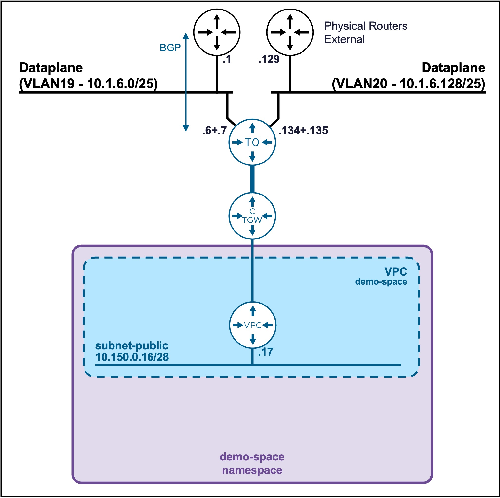
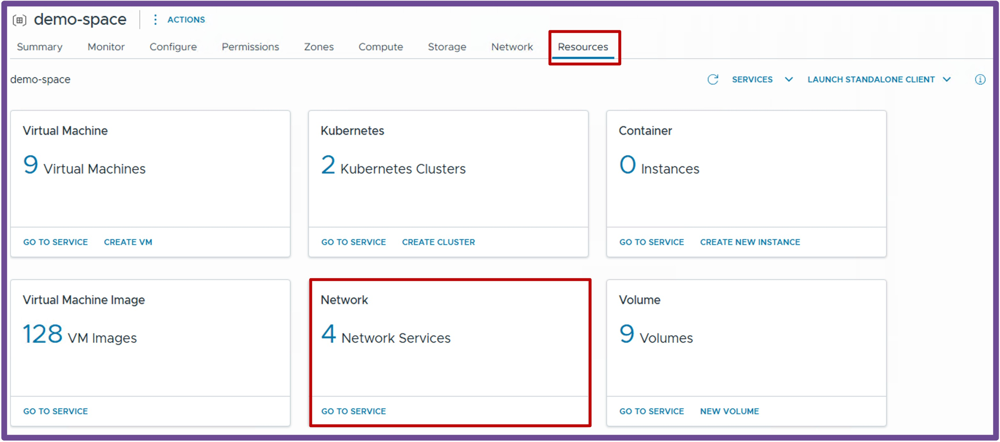
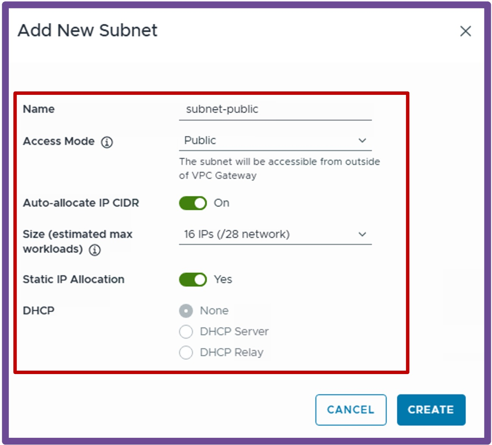
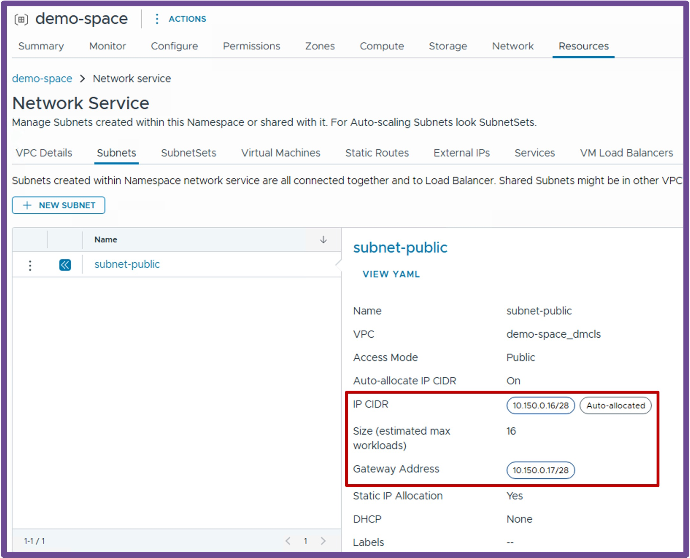

<h1>
   Supervisor with "NSX + CTGW/Edge/T0"
</h1>

This section describes the procedures for **provisioning and managing Network Services within a VKS Namespace utilizing an "NSX + CTGW/Edge/T0" architecture** inside a vSphere environment.

* **Network Services**
    * [**Subnets**](#networkservices)
    * [SubnetSets](3h2-network-subnetset.md)
    * [Static Routes](3h3-network-staticroute.md)
    * [External IPs](3h4-network-externalip.md)
    * [VM Load Balancers](3h5-network-lb.md)

{ width="100%" }

---

## Network Services - Subnets {: #networkservices }

{ width="55%" style="display: block; margin: 0 auto;" }

### Create Subnet

Navigate to **vCenter** > **Supervisor Management** > **Supervisors**, select your target Supervisor, click the **Namespaces** tab, and select your specific Namespace.  
Under the **Resources** card, click **Network - Go to Service**.  
{ width="95%" style="display: block; margin: 0 auto;" }

1. **Create New Subnet**  
Navigate to **Subnets**, and click **New Subnet**.  
{ width="70%" style="display: block; margin: 0 auto;" }  

For more information about Subnets settings review the [VPC Subnet Overlay page](../vcenter/1b-vpc_subnet.md#overlay){target="_blank"}.

---

### Validate Subnet Creation
Expand the newly created Subnet to view its assigned CIDR and VPC Gateway.
{ width="90%" style="display: block; margin: 0 auto;" }  

