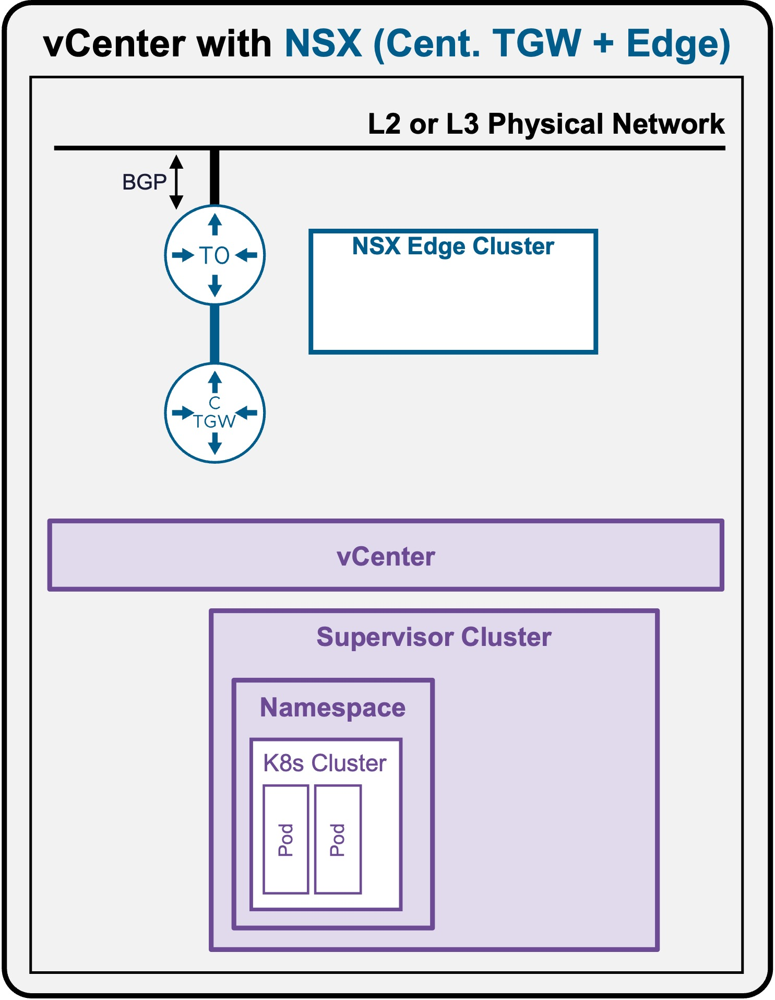
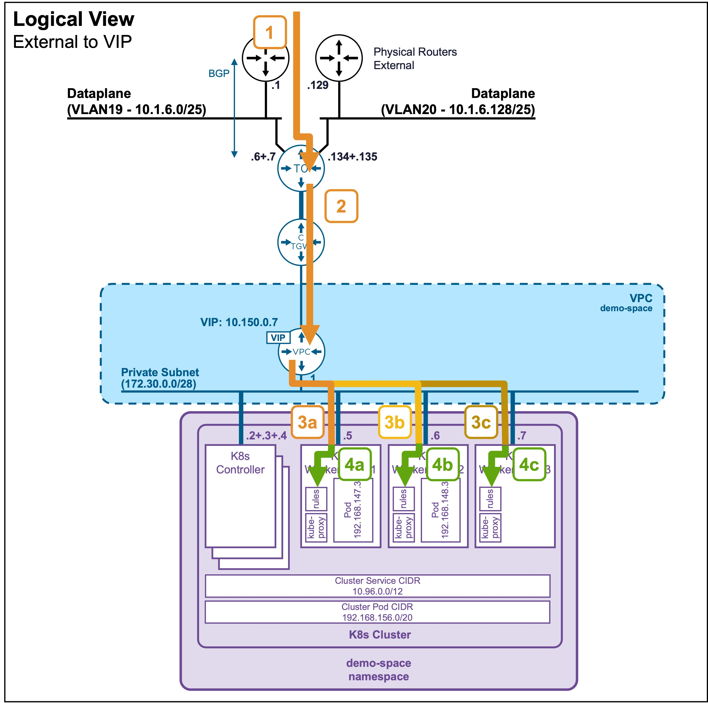
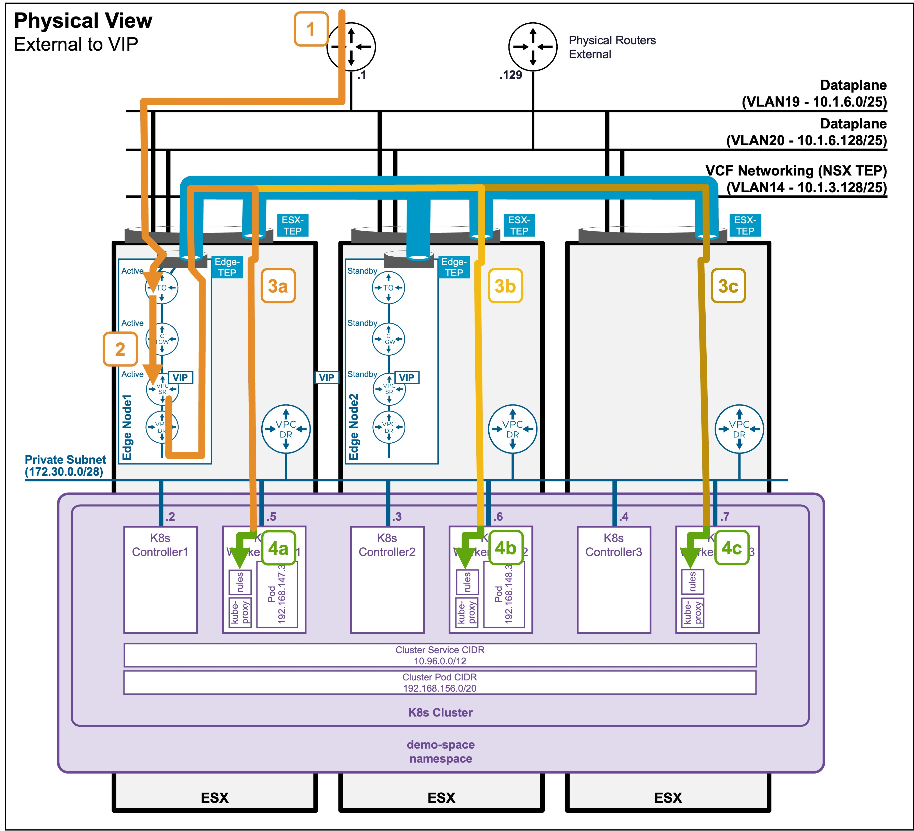

<h1>
   Supervisor with "NSX + CTGW/Edge/T0"
</h1>

This section describes the procedures for **Troubleshooting Network Services into the VKS Namespace utilizing an "NSX + CTGW/Edge/T0" architecture** inside a vSphere environment.

* **Packet Walk**  
    * [**N/S External to VIP**](#packetwalk)  
    * [N/S External to VM](3i2-packetwalk-ext_vm.md)  
    * [E/W Pod to Pod](3i3-packetwalk-pod_pod.md)  
    * [E/W VM to VM](3i4-packetwalk-vm_vm.md)  
* App Access Broken  
    * [VIP Access Down](3j1-troubleshooting-vip.md)  
    * [VM Access Down](3j2-troubleshooting-vm.md)  
    * [Pod Access Down](3j3-troubleshooting-pod.md)  

{ width="100%" }

---

## Packet Walk - N/S External to VIP {: #packetwalk }
A Full Application (Load Balancer + Pods) has been deployed (see [Application Deployment > App Deployment (K8s) > via CLI](3g1-deployment-pods.md#deployment_pods)).

### View

#### Logical View
{ width="75%" style="display: block; margin: 0 auto;" }

#### Physical View
{ width="95%" style="display: block; margin: 0 auto;" }

??? note "Physical View diagram - Active Logical Routers (T0, CTGW, VPC-SR)"
    For ease of reading in the diagram, all the Active logical routers (T0, CTGW, VPC-SR) have been placed in the same Edge Node1.  
    In a production environment, these will most likely be distributed among multiple Edge Nodes. In such cases, cross-Edge Node traffic would occur (which is not represented in these diagrams).

---

### Packet Walk

* **Step1: External Client enters the logical Networks via T0**  
`Client-IP => VIP:80 (10.150.0.7)`  

    The traffic enters the ESX where the Edge Node (hosting the Active T0) resides.  
    *Note: In an Active/Active T0 configuration (not represented here), client traffic would be distributed across all Edge Nodes hosting the T0.*  

* **Step2: T0 routes the traffic to the LB-VIP**  
`Client-IP => VIP:80 (10.150.0.7)`  
    The T0 routes the traffic to the Active CTGW, which then routes to the Active VPC-SR.  
    *Note: The Active CTGW and VPC-SR could be in different Edge Nodes. In such cases, cross-Edge Node traffic would occur (which is not represented in these diagrams).*

* **Step3: VIP load balances traffic to the K8s Worker Nodes (kube-proxy)**  
<code>Edge-TEP_IP (10.1.3.x) => ESX-TEP_IP (10.1.3.x) 
&nbsp;&nbsp;[VPC-SR-Internal-IP => K8s WorkerNode[1-3]:31147 (172.30.0.[x])]
</code>

    The load balancer (VPC-SR) hosted on the Edge Node forwards the traffic to the dynamically assigned NodePort on the K8s Worker Nodes hosted on the different ESX.  
    The traffic from the Edge Node to the ESX hosting the Worker Node is encapsulated between the Edge-TEP and ESX-TEP.

    ??? info ":material-magnify: Find the dynamically assigned Worker Node TCP port (`31147`)"
        You can find the dynamically assigned Worker Node TCP port (`31147`) by running the command `kubectl get service apache-vip-service -n ns1` and looking under the PORT(S) column (see [Application Deployment > App Deployment (K8s) > via CLI](2g1-deployment-pods.md#deployment_pods)) 

* **Step 4: The K8s Worker Node intercepts the traffic**  
    Once the traffic arrives at the Worker Node's network interface on the NodePort (`31147`), it is intercepted by the node's local routing rules (which are continuously programmed by the local `kube-proxy` pod).

* **Step 5 (not represented): The Worker Node load balances traffic to the Pods**  
    Based on those `kube-proxy` rules, the Worker Node load balances the traffic to the different pods across the K8s cluster.  
    See [Packet Walk - E/W pod to pod](3i3-packetwalk-pod_pod.md#packetwalk) for cross-pod communication.

