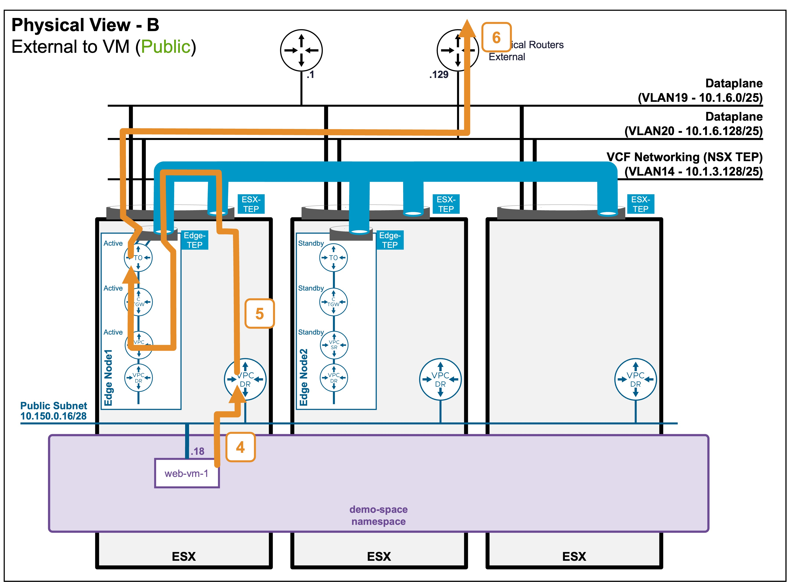

<h1>
   Supervisor with "NSX + CTGW/Edge/T0"
</h1>

This section describes the procedures for **Troubleshooting Network Services into the VKS Namespace utilizing an "NSX + CTGW/Edge/T0" architecture** inside a vSphere environment.

* **Packet Walk**  
    * [N/S External to VIP](3i1-packetwalk-ext_vip.md)  
    * [**N/S External to VM**](#packetwalk)  
    * [E/W Pod to Pod](3i3-packetwalk-pod_pod.md)  
    * [E/W VM to VM](3i4-packetwalk-vm_vm.md)  
* App Access Broken  
    * [VIP Access Down](3j1-troubleshooting-vip.md)  
    * [VM Access Down](3j2-troubleshooting-vm.md)  
    * [Pod Access Down](3j3-troubleshooting-pod.md)  

{ width="100%" }

---

## Packet Walk - N/S External to VM {: #packetwalk }

One or a few VMs have been deployed (see [Application Deployment > App Deployment (VMs) > via vCenter UI](3f1-deployment-vms.md#deployment_vms) or [Application Deployment > App Deployment (VMs) > via CLI](3f2-deployment-vms.md#deployment_vms)).

### View

#### Logical View
* **Scenario A: VM connected to Private Subnet (Private-VPC or Private-TGW)**  
{ width="75%" style="display: block; margin: 0 auto;" }
In this case, external clients can't reach that subnet, and so can't reach VMs on it.

* **Scenario B: VM connected to Public Subnet**  
{ width="75%" style="display: block; margin: 0 auto;" }

#### Physical View
* **Scenario B: VM connected to Public Subnet**  
{ width="95%" style="display: block; margin: 0 auto;" }

{ width="95%" style="display: block; margin: 0 auto;" }

---

### Packet Walk

#### North/South: External Client to the VM

* **Step1: External Client enters the logical Networks via T0**  
`Client-IP => VM1 (10.150.0.18)`  

    The traffic enters the ESX where the Edge Node (hosting the Active T0) resides.  
    *Note: In an Active/Active T0 configuration (not represented here), client traffic would be distributed across all Edge Nodes hosting the T0.*  

* **Step2: T0 routes the traffic to the VPC**  
`Client-IP => VM1 (10.150.0.18)`  

    The T0 routes the traffic to the Active CTGW, which then routes it to the Active VPC-SR.  
    *Note: The Active CTGW and VPC-SR could reside on different Edge Nodes. In such cases, cross-Edge Node traffic would occur (which is not represented in these diagrams).*

* **Step3: VPC forwards the traffic to the VM**  
`Client-IP => VM1 (10.150.0.18)`  

    The Active VPC-SR routes the traffic to its VPC-DR and forwards it directly to the VM.  
    The traffic passing from the Edge Node to the ESXi host where the VM resides is encapsulated between the Edge TEP and the ESXi TEP.

#### South/North: VM replies to the External Client
!!! info "The return traffic follows a different path!"

* **Step4: VM sends traffic to its default gateway**  
` VM1 (10.150.0.18) => Client-IP`  
    The VM sends the packet to its default gateway (VPC-DR) hosted on its local ESX.
    
* **Step5: VPC routes traffic up to T0**  
` VM1 (10.150.0.18) => Client-IP`  

    VPC-DR routes to its default gateway: VPC-SR.  
    VPC-SR routes to the default gateway: CTGW-Active.  
    CTGW routes to the default gateway: T0-Active.  
    *Note: The Active CTGW and VPC-SR could be on different Edge Nodes, initiating cross-Edge Node traffic.  
    Also, in an Active/Active T0 configuration, client traffic would be distributed across all Edge Nodes hosting the T0.*

* **Step6: T0 routes to the physical fabric**  
` VM1 (10.150.0.18) => Client-IP`  

    T0-Active routes to its default gateway: Physical Router.  
    *Note: In the case of multiple physical routers configured in Active/Active (as represented), the T0 routes traffic among all available physical routers.*

!!! info "Architectural Note: Asymmetric Routing"
    As represented in the diagrams, the North/South traffic is processed in an Active/Active fashion across the physical routers and the T0-Active.  
    Consequently, a specific flow can be asymmetric: processed by one physical router inbound, and a different physical router outbound. This asymmetric routing is completely transparent to the communication flow and the applications.

    !!! Warning "Stateless Physical Routing Required"
        Because the traffic path can be asymmetric, the upstream physical network devices must operate as standard routers, not stateful firewalls.  
        A stateful firewall will flag asymmetric return traffic as invalid and drop the packets.
