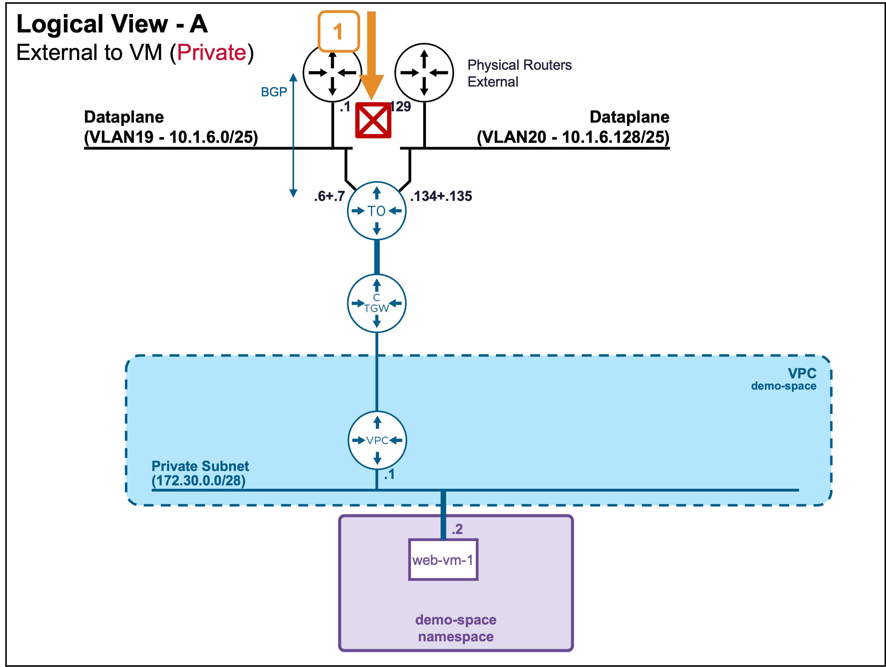
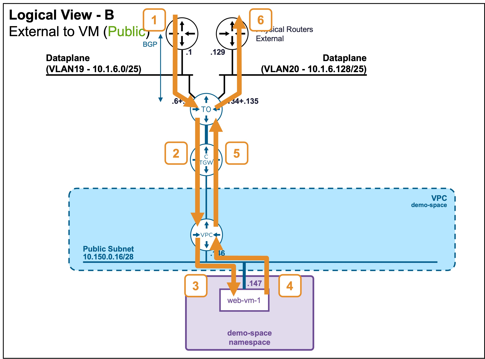
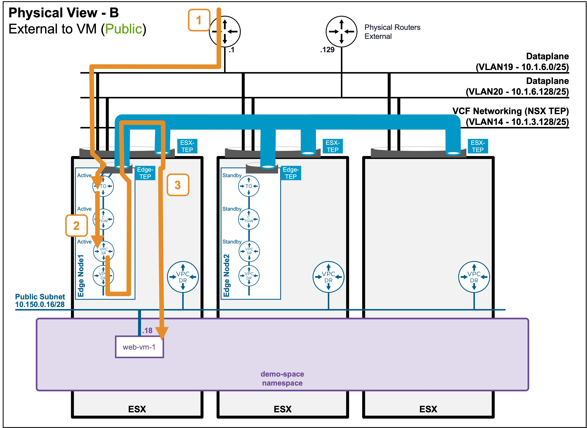
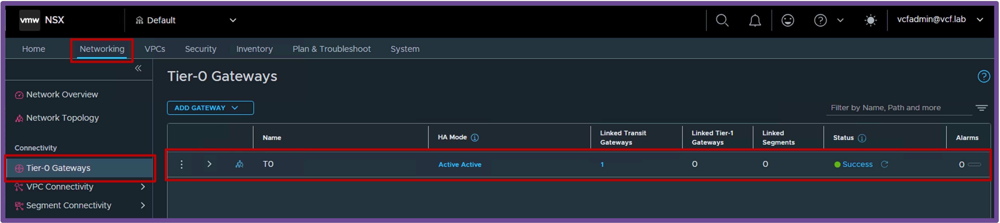
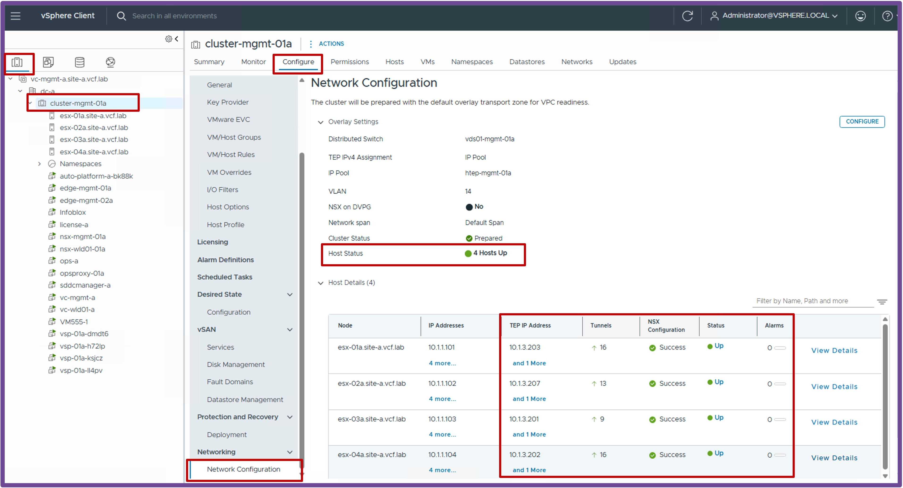
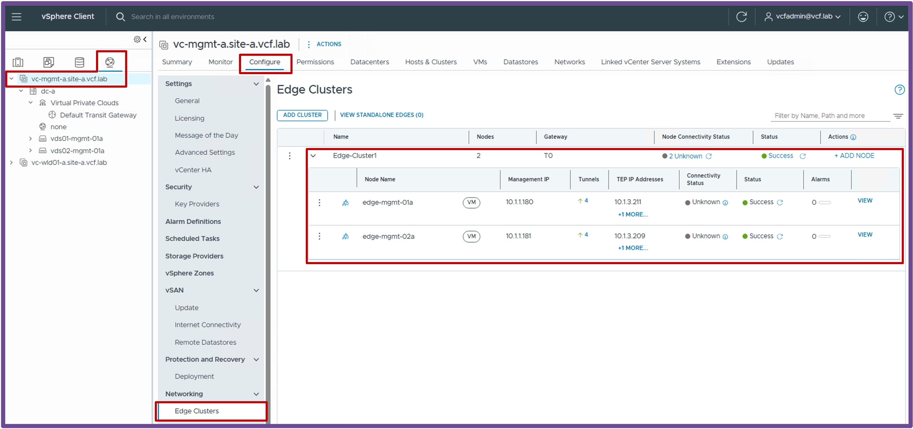

<h1>
   Supervisor with "NSX + CTGW/Edge/T0"
</h1>

<div class="grid" markdown style="grid-template-columns: 60% 40%">

<div markdown>

This section describes the procedures for **Troubleshooting Network Services into the VKS Namespace utilizing an "NSX + CTGW/Edge/T0" architecture** inside a vSphere environment.

* Packet Walk  
    * [N/S External to VIP](3i1-packetwalk-ext_vip.md)  
    * [N/S External to VM](3i2-packetwalk-ext_vm.md)  
    * [E/W pod to pod](3i3-packetwalk-pod_pod.md)  
    * [E/W VM to VM](3i4-packetwalk-vm_vm.md)  
* **App Access Broken**  
    * [VIP Access Down](3j1-troubleshooting-vip.md)  
    * [**VM Access Down**](#troubleshooting)  
    * [Pod Access Down](3j3-troubleshooting-pod.md)  

</div>

<div markdown>
{ width="100%" }
</div>
</div>

---

## Troubleshooting - VM access down {: #troubleshooting }

As described in the [Packet Walk - N/S External to VM](3i2-packetwalk-ext_vm.md) section, clients accessing a VM traverse the following path:

### Logical and Physical View
* **Scenario A: VM connected to Private Subnet (Private-VPC or Private-TGW)**  
{ width="75%" style="display: block; margin: 0 auto;" }
In this case, external clients can't reach that subnet, and so can't reach VMs on it.

* **Scenario B: VM connected to Public Subnet**  
{ width="75%" style="display: block; margin: 0 auto;" }

{ width="95%" style="display: block; margin: 0 auto;" }

### Troubleshooting Steps
#### Step1: External Client enters the logical Networks via T0
* **Validate BGP communication between the T0 and the physical routers**  

    ??? info "Status Validation: BGP"
        The T0 status is only available from NSX.  
        Navigate to **NSX** > **Networking** > **Tier-0 Gateways**.  
        Ensure the T0 has a Green status and no Alarms.
        { width="95%" style="display: block; margin: 0 auto;" }

        > **Note:** In the event of a BGP connection issue, the T0 status will show as Red, and the Alarms section will display BGP-related errors.

#### Step2+3: T0 routes the traffic to the VM

* **Validate the ESX host and Edge tunnels are UP**

    ??? info "Status Validation: TEP Tunnels"
        ESX host tunnels status, navigate to **vCenter** > **Host and Clusters** > **[your vCenter Cluster]** > **Configure** > **Networking** > **Network Configuration**.  
        Ensure "Cluster Status" and "Host Status" are "Green", and ESX have at least 1 TEP IP Address:  
        { width="95%" style="display: block; margin: 0 auto;" }

        Edge tunnels status, navigate to **vCenter** > **Networking** > **vCenter** > **Configure** > **Networking** > **Edge Clusters**.  
        { width="95%" style="display: block; margin: 0 auto;" }

        > **Note:** If no workloads have been deployed on logical networks yet, it is normal to have zero tunnels established on the ESX hosts.  


* **Validate the ESX host and Edge tunnels accept large packets (MTU)**   

    ??? info "Status Validation: Jumbo Frames"
        ```text
        vmkping ++netstack=vxlan <remote-ESX-TEP-IP & Edge-TEP-IP> -d -s 8900
        ```

        ??? info ":material-magnify: How to find remote-ESX-TEP-IP and Edge-TEP-IP"
            remote-ESX-TEP-IP are available on **vCenter** > **Host and Clusters** > **[your vCenter Cluster]** > **Configure** > **Networking** > **Network Configuration**.  
            { width="95%" style="display: block; margin: 0 auto;" }
            Edge-TEP-IP are available on **vCenter** > **Networking** > **vCenter** > **Configure** > **Networking** > **Edge Clusters**.  
            { width="95%" style="display: block; margin: 0 auto;" }


        ??? abstract "Output example: vmkping"
            From the ESX CLI:  
            <pre><code>[root@esx-01a:~] <b>vmkping ++netstack=vxlan 10.1.3.207 -d -s 8900</b>
                PING 10.1.3.207 (10.1.3.207): 8900 data bytes
                8908 bytes from 10.1.3.207: icmp_seq=0 ttl=64 time=1.234 ms
                8908 bytes from 10.1.3.207: icmp_seq=1 ttl=64 time=1.102 ms
                8908 bytes from 10.1.3.207: icmp_seq=2 ttl=64 time=1.098 ms
                --- 10.1.3.207 ping statistics ---
                3 packets transmitted, 3 packets received, 0% packet loss
                round-trip min/avg/max = 1.098/1.144/1.234 ms
            </code></pre>
            If vmkping doesn't work, consult with your Network Team to determine why routing does not reach the destination.  
            
            * If standard "small" pings fail, the issue is typically related to routing misconfigurations or firewall blockages.  
            * If "large" pings fail, the issue is typically related to Jumbo Frames (MTU) not being enabled across the physical fabric.

* **Validate communication to the VM**  

    ??? info "Status Validation: Ping"
        <pre><code>PS C:\Users\Administrator\Documents> <b>ping 10.150.0.18</b>
        Pinging 10.150.0.18 with 32 bytes of data:
        Reply from 10.150.0.18: bytes=32 time=6ms TTL=61
        Reply from 10.150.0.18: bytes=32 time=1ms TTL=61
        </code></pre>

        In case of failure, check the routing breaking point with `traceroute`.  
        
        ??? info "Status Validation: Traceroute"
            <pre><code>PS C:\Users\Administrator\Documents> <b>tracert 10.150.0.18</b>
            1    &lt;1 ms    &lt;1 ms    &lt;1 ms  router.site-a.vcf.lab [10.1.10.129]
            2     2 ms     1 ms    &lt;1 ms  edge-uplink02-wld01-02a.site-a.vcf.lab [10.1.6.135]
            3     2 ms     1 ms     1 ms  169.254.64.3
            4     1 ms     1 ms     1 ms  10.150.0.18
            </code></pre>
            
            > **Note:** Depending on your Operating System, the exact command may vary (e.g., `traceroute`, `tracert`, `tracepath`).  
    
            Consult with your Network Team to determine why routing does not reach the destination.  
            The issue is typically related to routing misconfigurations or firewall blockages.

